# 🐾 PokéPals Interactive

A fun, kid-friendly Pokémon adventure app with AI-powered interactions, built with Next.js, React, and the Vercel AI SDK!

## 🎓 Built During the AI Engineer Onramp Bootcamp

This project was created as part of the [**AI Makerspace AI Engineer Onramp Bootcamp**](https://github.com/AI-Maker-Space) – where brave students embark on an exciting journey to master AI-assisted development, agentic coding, and modern software engineering practices.

**Who says you can't have a little fun along the way?** 🚀

This app showcases what happens when AI-assisted development meets creativity, demonstrating that learning can be both educational *and* delightful! Unlike its simpler sibling, this version adds **AI-powered features** including an interactive chat assistant (Professor Pine) and dynamic content generation.

---

## ✨ Features

### 🤖 AI-Powered Interactions
- 💬 **Professor Pine Chat**: Kid-safe AI assistant with content filtering
- 📖 **Story Generator**: Create imaginative Pokémon adventures
- 🧩 **Quiz Generator**: AI-generated quizzes about Pokémon
- 💡 **Fun Facts**: Discover interesting Pokémon trivia
- 🎨 **Game Hints**: Get helpful guidance for activities

### 🎮 Interactive Activities
- 🔍 **Guess That Pokémon**: Test your Pokémon knowledge
- 🎨 **Color Playground**: Creative drawing with AI prompts
- 🧩 **Pokémon Quiz**: Answer questions about your favorite creatures

### 🌟 Additional Features
- 🔎 **Pokémon Exploration**: Discover creatures by type using PokeAPI
- 🎨 **3 Fun Themes**: Candy, Space, and Ocean themes for different moods
- 📱 **Mobile-Friendly**: Designed for kids on tablets and phones
- 🌈 **Playful Animations**: Gentle, kid-friendly motion and delight
- ♿ **Accessible**: High contrast, clear typography, large touch targets
- 🔒 **Content Safety**: Multi-layer filtering for kid-appropriate content

## 🚀 Getting Started

### Prerequisites

- Node.js 18+ installed
- OpenAI API key ([get one here](https://platform.openai.com/api-keys))

### Environment Setup

1. Install dependencies:
```bash
npm install
```

2. Copy the example environment file:
```bash
cp .env.example .env.local
```

3. Edit `.env.local` and add your OpenAI API key:
```bash
OPENAI_API_KEY=sk-your-actual-api-key-here
```

### Run the Development Server

```bash
npm run dev
```

Open [http://localhost:3000](http://localhost:3000) with your browser to see your PokéPals come to life!

You can start editing the page by modifying `app/page.tsx`. The page auto-updates as you edit the file.

## 🏗️ Built With

### Core Framework & UI
- **[Next.js 16](https://nextjs.org)** - React framework with App Router and SSR
- **[React 19](https://react.dev)** - UI library with Server and Client Components
- **[TypeScript](https://www.typescriptlang.org)** - Type safety with strict mode throughout
- **[Tailwind CSS 4](https://tailwindcss.com)** - Utility-first styling with OKLCH color space
- **[Radix UI](https://www.radix-ui.com)** - Accessible component primitives (via shadcn/ui)

### AI Integration
- **[Vercel AI SDK](https://sdk.vercel.ai)** - AI integration with streaming and structured outputs
- **[OpenAI GPT-5-nano](https://platform.openai.com)** - Fast, cost-effective language model
- **[Zod](https://zod.dev)** - Runtime schema validation for AI responses

### External Services
- **[PokeAPI](https://pokeapi.co)** - Free Pokémon data (no auth required)
- **[Lucide React](https://lucide.dev)** - Beautiful icon system

## 📝 Available Scripts

```bash
# Start development server
npm run dev

# Build for production
npm run build
```

## 🎨 Themes

PokéPals Interactive includes three delightful themes:

- 🍬 **Candy** (default): Bright pinks and bubblegum colors
- 🌌 **Space**: Dark purples and blues with cosmic vibes
- 🌊 **Ocean**: Teals and aquas with underwater effects

Switch themes using the theme switcher on any page! All themes use OKLCH color space for perceptually uniform colors.

## 🏗️ Architecture

### System Overview

PokéPals Interactive follows a **three-tier layered architecture** built entirely with TypeScript and React:

```mermaid
graph TB
    subgraph "Presentation Layer (Client)"
        UI[React Components<br/>Server & Client]
        Pages[Next.js Pages<br/>SSR]
    end

    subgraph "Business Logic Layer (API Routes)"
        API[7 AI Endpoints<br/>/api/llm/*]
        Validation[Zod Schemas<br/>Type Safety]
    end

    subgraph "Data/Infrastructure Layer"
        PokeAPI[PokeAPI<br/>Pokémon Data]
        OpenAI[OpenAI<br/>GPT-5-nano]
        Storage[LocalStorage<br/>Theme State]
    end

    UI --> Pages
    Pages --> API
    API --> Validation
    Validation --> OpenAI
    UI --> PokeAPI
    UI --> Storage

    style UI fill:#ff6ec7,stroke:#333,color:#fff
    style API fill:#4ecdc4,stroke:#333
    style OpenAI fill:#95e1d3,stroke:#333
```



**Layer Responsibilities:**

1. **Presentation Layer** (`/app`, `/components`)
   - Server Components for initial SSR renders
   - Client Components marked with `"use client"` for interactivity
   - Theme switching via React Context + CSS custom properties

2. **Business Logic Layer** (`/app/api/llm/*`)
   - 7 AI endpoints: chat, quiz, story, query-pokeapi, game-hints, color-prompt, fun-fact
   - Content safety filtering with blocked pattern detection
   - 30-second timeout protection (`maxDuration = 30`)
   - Zod schema validation for structured outputs

3. **Data/Infrastructure Layer**
   - **PokeAPI**: Direct client-side fetch (public API, no auth)
   - **OpenAI**: Server-side via Vercel AI SDK (API key required)
   - **LocalStorage**: Client-side theme preference persistence

### Data Flow Patterns

The application implements four main data flow patterns:


**Pattern Types:**
1. **Direct API Pattern**: Pokémon data fetched directly from PokeAPI (client-side)
2. **Streaming AI Pattern**: Chat uses Server-Sent Events (SSE) for real-time responses
3. **Structured Generation**: Quiz/Story/Search use `generateObject()` with Zod schemas
4. **Theme Management**: React Context + localStorage + CSS custom properties

For detailed architecture documentation, see [`architecture/`](./architecture/README.md).

## 🗂️ Project Structure

```
poke-pals-interactive/
├── app/                      # Next.js App Router (pages & API)
│   ├── api/llm/              # AI route handlers (7 endpoints)
│   │   ├── chat/             # Streaming chat with Professor Pine
│   │   ├── story/            # Story generation with AI
│   │   ├── quiz/             # Quiz question generation
│   │   ├── fun-fact/         # Fun fact generation
│   │   ├── game-hints/       # Progressive game hints
│   │   ├── color-prompt/     # Art prompt generation
│   │   └── query-pokeapi/    # Natural language Pokémon search
│   ├── explore/              # Pokémon exploration page
│   ├── chat/                 # Professor Pine chat interface
│   ├── games/                # Interactive games hub
│   ├── stories/              # AI story builder
│   ├── themes/               # Theme switcher page
│   ├── layout.tsx            # Root layout with ThemeProvider
│   ├── page.tsx              # Homepage
│   └── globals.css           # Global styles + theme CSS variables
│
├── components/               # React components
│   ├── ui/                   # Radix UI primitives (shadcn/ui)
│   │   ├── button.tsx        # Button component (6 variants)
│   │   ├── card.tsx          # Card container component
│   │   ├── input.tsx         # Form input component
│   │   ├── dialog.tsx        # Modal dialog component
│   │   └── tabs.tsx          # Accessible tab component
│   ├── games/                # Game feature components
│   │   ├── guess-game.tsx    # "Who's That Creature" game
│   │   ├── quiz-game.tsx     # AI-powered quiz game
│   │   └── color-playground.tsx  # Creative drawing game
│   ├── professor-pine-chat.tsx   # AI chat UI component
│   ├── pokemon-explorer.tsx      # Pokémon browser/search
│   ├── pokemon-grid.tsx          # Pokémon card grid display
│   ├── story-builder.tsx         # Interactive story builder
│   ├── theme-provider.tsx        # Theme context provider
│   ├── theme-switcher.tsx        # Theme selection UI
│   ├── navigation.tsx            # App navigation
│   ├── page-wrapper.tsx          # Consistent page layout
│   └── ...                       # Additional feature components
│
├── lib/                      # Utilities and helpers
│   └── utils.ts              # cn() helper for Tailwind
│
├── architecture/             # Comprehensive architecture docs
│   ├── README.md             # Architecture overview
│   ├── diagrams/             # Mermaid architecture diagrams
│   └── docs/                 # Detailed documentation
│
├── next.config.ts            # Next.js configuration
├── tsconfig.json             # TypeScript configuration (strict mode)
├── tailwind.config.ts        # Tailwind CSS configuration
└── package.json              # Dependencies and scripts
```

### Path Aliases

The project uses TypeScript path aliases for clean imports:

```typescript
// tsconfig.json configured with @/* → ./*
import { Button } from '@/components/ui/button'
import { cn } from '@/lib/utils'
import { PokemonGrid } from '@/components/pokemon-grid'
```

## 🔒 Content Safety

This app is designed for kids ages 6-10 with multiple safety layers:

- **AI Content Filtering**: Pre-filter and post-filter inappropriate content
- **Grade 2-4 Reading Level**: Age-appropriate language
- **Professor Pine Personality**: Encouraging, supportive, and kid-friendly
- **Response Limits**: Concise responses (~100 words)
- **Topic Redirection**: Scary/inappropriate topics redirected to positive ones
- **No Personal Data**: Never collects or shares personal information

## 🧪 Testing Strategy

This project is designed for testing but test files are not currently in the repository. When adding tests, consider:

- **API Endpoint Tests**: Validate AI route behavior and response formats
- **Component Tests**: Test user interactions and component rendering
- **Integration Tests**: Verify end-to-end user journeys
- **Recommended Tools**: Vitest + React Testing Library + MSW for API mocking

The architecture is built with testability in mind, with clear separation between presentation, business logic, and data layers.

## 🤝 Contributing

This is a learning project built during the AI Engineer Onramp Bootcamp. Feel free to fork it and make it your own!

## 📚 Learn More

### Framework & Core Technologies
- [Next.js Documentation](https://nextjs.org/docs) - App Router, Server Components, API Routes
- [React Documentation](https://react.dev) - React 19 features and best practices
- [TypeScript Handbook](https://www.typescriptlang.org/docs/) - TypeScript patterns and features
- [Next.js GitHub repository](https://github.com/vercel/next.js)

### AI Integration
- [Vercel AI SDK Documentation](https://sdk.vercel.ai) - Streaming, structured outputs, React hooks
- [OpenAI API Reference](https://platform.openai.com/docs/api-reference) - GPT models and capabilities
- [Zod Documentation](https://zod.dev) - Schema validation and type safety

### UI & Styling
- [Tailwind CSS Documentation](https://tailwindcss.com/docs) - Utility-first CSS framework
- [Radix UI Documentation](https://www.radix-ui.com) - Accessible component primitives
- [shadcn/ui](https://ui.shadcn.com) - Component patterns and examples

### External APIs
- [PokeAPI Documentation](https://pokeapi.co/docs/v2) - Pokémon data API reference

### Learning Resources
- [AI Makerspace](https://github.com/AI-Maker-Space) - AI Engineer Onramp Bootcamp
- [Learn Next.js](https://nextjs.org/learn) - Interactive Next.js course

## 🚀 Deploy on Vercel

The easiest way to deploy your Next.js app is to use the [Vercel Platform](https://vercel.com/new?utm_medium=default-template&filter=next.js&utm_source=create-next-app&utm_campaign=create-next-app-readme).

**Important**: Set your `OPENAI_API_KEY` environment variable in the Vercel project settings.

Check out the [Next.js deployment documentation](https://nextjs.org/docs/app/building-your-application/deploying) for more details.

## 🙏 Acknowledgments

A huge thank you to:

- **[PokeAPI](https://pokeapi.co/)** - For providing free, open access to Pokémon data. This project wouldn't exist without their incredible work making Pokémon information available to developers worldwide!
- **[Vercel](https://vercel.com)** - For the amazing AI SDK that makes building AI-powered apps delightful
- **[OpenAI](https://openai.com)** - For providing the language models powering Professor Pine
- **The Pokémon Company** - For creating the beloved franchise that brings joy to kids (and adults!) everywhere
- **[AI Makerspace](https://github.com/AI-Maker-Space)** - For fostering a learning environment where projects like this can flourish

## ⚖️ Legal Notice

This is an unofficial, non-commercial fan project created for educational purposes.

- **Not affiliated with** Nintendo, Game Freak, or The Pokémon Company
- **[PokeAPI](https://pokeapi.co/)** is a free, community-maintained resource not affiliated with official Pokémon organizations
- **Pokémon** names, sprites, and all related intellectual property belong to their respective owners
- The **[MIT License](LICENSE)** applies only to the original source code in this repository and does **not** grant any rights to Pokémon intellectual property
- **API Usage**: This app uses the OpenAI API - you are responsible for your own API costs and usage

Made with love for learning! 💜

---

**Made with 💜 by a proud peer supporter of the AI Engineer Onramp Bootcamp**

*Celebrating the brave students who are learning, building, and having fun along the way!*
