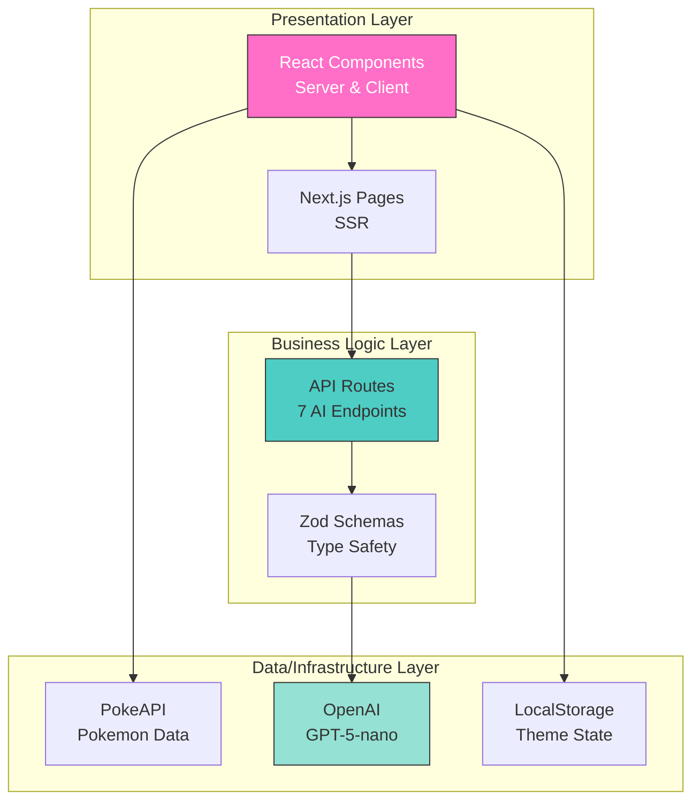
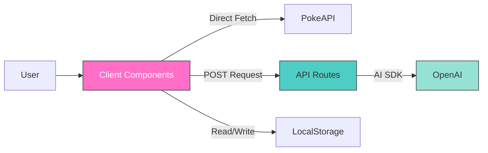
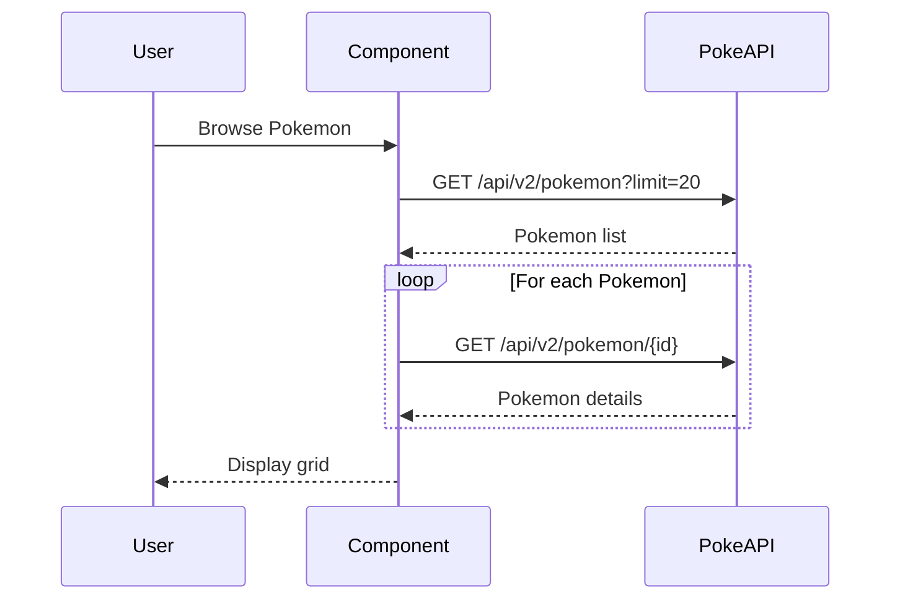
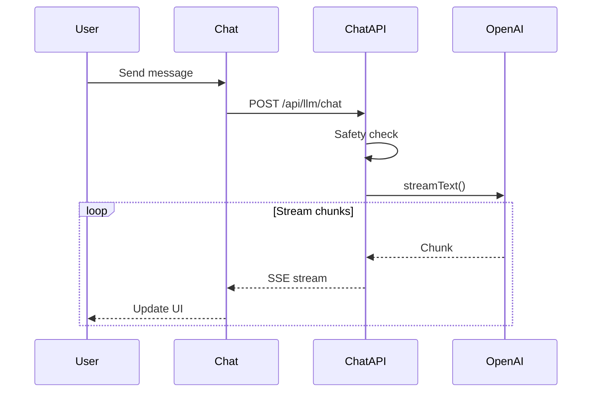
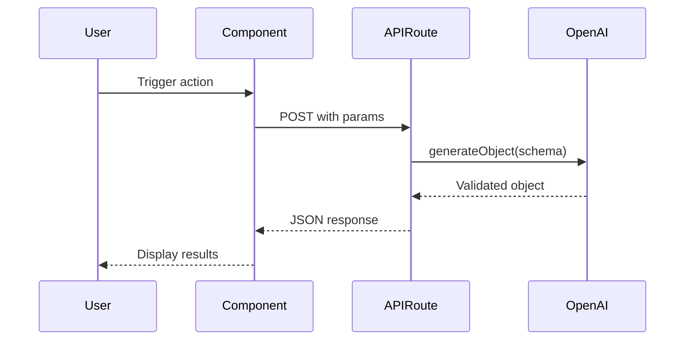
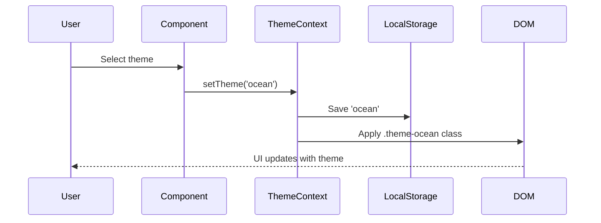

# Repository Architecture Documentation

## Overview

**PokePals Interactive** is a modern, AI-powered Pokemon exploration platform designed for children (grades 2-4). Built with Next.js 16, React 19, and OpenAI's GPT-5-nano model, it provides an educational and entertaining experience featuring Pokemon discovery, interactive storytelling, games, and an AI chat companion.

### What It Does

- **Pokemon Exploration**: Browse and search 151 original Pokemon with natural language queries
- **AI Chat**: Converse with Professor Pine, a kid-friendly AI assistant
- **Interactive Stories**: Create branching narratives with AI-generated content
- **Educational Games**: Quiz games, guessing games, and creative drawing prompts
- **Theming**: Three visual themes (candy, space, ocean) with persistent preferences

### Key Technologies

| Technology | Version | Purpose |
|------------|---------|---------|
| Next.js | 16.0.3 | Full-stack framework with App Router |
| React | 19.2.0 | UI component library |
| TypeScript | 5.x | Type safety throughout |
| Vercel AI SDK | Latest | OpenAI integration with streaming |
| Tailwind CSS | 4.1.9 | Styling and theming |
| Radix UI | Various | Accessible UI primitives |
| Zod | Latest | Runtime schema validation |

**External Services:**
- PokeAPI (https://pokeapi.co) - Pokemon data
- OpenAI API (GPT-5-nano) - AI-powered features

---

## Quick Start

### How to Use This Documentation

This documentation suite is designed for progressive exploration:

1. **Start here** for the big picture and navigation
2. **Dive into specific docs** for detailed analysis
3. **Reference the API docs** when implementing features
4. **Use diagrams** to understand system interactions

### Document Index

| Document | Description | Best For |
|----------|-------------|----------|
| [Component Inventory](./docs/01_component_inventory.md) | Complete catalog of Python components | Understanding Python integration |
| [Architecture Diagrams](./diagrams/02_architecture_diagrams.md) | Visual system architecture | Onboarding, system design review |
| [Data Flows](./docs/03_data_flows.md) | Sequence diagrams and flow analysis | Understanding request/response patterns |
| [API Reference](./docs/04_api_reference.md) | Complete API documentation | Implementing features, integration |

---

## Architecture Summary

### System Design

The application follows a **three-tier layered architecture**:



### Technology Stack

**Why These Technologies:**

- **Next.js 16**: Modern full-stack framework with excellent DX, built-in API routes, and SSR capabilities
- **Vercel AI SDK**: Simplifies OpenAI integration with streaming, structured outputs, and React hooks
- **TypeScript + Zod**: End-to-end type safety from database to UI, with runtime validation
- **Tailwind CSS**: Rapid development with utility-first approach, custom theming via CSS variables
- **Radix UI**: Accessible primitives that work out of the box, customizable with Tailwind

### Layered Architecture

#### 1. Presentation Layer
- **Location**: `/app` (pages), `/components` (UI)
- **Responsibility**: Rendering UI, handling user interactions, managing client state
- **Pattern**: Server Components for initial render, Client Components for interactivity
- **Key Files**:
  - `/app/page.tsx` - Homepage
  - `/app/chat/page.tsx` - Chat interface
  - `/app/explore/page.tsx` - Pokemon explorer
  - `/components/professor-pine-chat.tsx` - AI chat component

#### 2. Business Logic Layer
- **Location**: `/app/api/llm/*`
- **Responsibility**: AI orchestration, content safety, request validation, response formatting
- **Pattern**: POST endpoints with JSON payloads, streaming or structured responses
- **Key Features**:
  - Content safety filtering (blocked patterns)
  - Zod schema validation
  - Fallback content for errors
  - 30-second timeout protection

#### 3. Data/Infrastructure Layer
- **External APIs**:
  - PokeAPI (direct client calls, no auth)
  - OpenAI API (server-side via AI SDK, API key required)
- **Client Storage**: localStorage for theme preferences
- **Caching**: Client-side Pokemon data caching



---

## Component Overview

### Core Components

The application consists primarily of TypeScript/React components with minimal Python scaffolding:

| Component | Purpose | Location | Type |
|-----------|---------|----------|------|
| **Professor Pine Chat** | AI chat interface | `/components/professor-pine-chat.tsx` | Client Component |
| **Pokemon Explorer** | Browse/search Pokemon | `/components/pokemon-explorer.tsx` | Client Component |
| **Pokemon Grid** | Display Pokemon cards | `/components/pokemon-grid.tsx` | Client Component |
| **Story Builder** | Interactive AI stories | `/components/story-builder.tsx` | Client Component |
| **Games Hub** | Game selection | `/components/games-hub.tsx` | Client Component |
| **Theme Provider** | Theme management | `/components/theme-provider.tsx` | Context Provider |
| **Page Wrapper** | Layout consistency | `/components/page-wrapper.tsx` | Layout Component |

### Component Categories

#### UI Primitives (`/components/ui/`)
Radix UI-based components with consistent styling:
- `button.tsx` - 6 variants, 6 sizes
- `card.tsx` - Container with header/content/footer
- `input.tsx` - Styled form inputs
- `dialog.tsx` - Modal dialogs
- `tabs.tsx` - Accessible tab navigation

#### Feature Components (`/components/`)
Business logic and user-facing features:
- **Chat**: `professor-pine-chat.tsx`
- **Exploration**: `pokemon-explorer.tsx`, `pokemon-grid.tsx`, `pokemon-detail-modal.tsx`
- **Games**: `games/guess-game.tsx`, `games/quiz-game.tsx`, `games/color-playground.tsx`
- **Stories**: `story-builder.tsx`
- **Theme**: `theme-provider.tsx`, `theme-switcher.tsx`

#### Layout Components
Structural elements:
- `page-wrapper.tsx` - Consistent page structure
- `navigation.tsx` - Site navigation
- `footer.tsx` - Footer with links

#### API Routes (`/app/api/llm/`)
Server-side AI endpoints:
- `chat/route.ts` - Streaming chat
- `quiz/route.ts` - Quiz generation
- `story/route.ts` - Story generation
- `query-pokeapi/route.ts` - Natural language search
- `game-hints/route.ts` - Hint generation
- `color-prompt/route.ts` - Drawing prompts
- `fun-fact/route.ts` - Fun facts

---

## Data Flows

### Primary Flow Patterns

The application implements four main data flow patterns:

#### 1. Direct API Pattern (Pokemon Data)



**Characteristics:**
- Client-side fetch calls
- No authentication required
- Pagination (20 per page)
- Client-side filtering

#### 2. Streaming AI Pattern (Chat)



**Characteristics:**
- Server-Sent Events (SSE)
- Real-time streaming
- Content safety filters
- Conversation history maintained

#### 3. Structured Generation Pattern (Quiz, Story, Search)



**Characteristics:**
- Zod schema validation
- Type-safe responses
- Fallback content on errors
- Structured JSON output

#### 4. Theme Management Pattern



**Characteristics:**
- React Context API
- localStorage persistence
- CSS custom properties
- Client-side only

### Key Integration Points

**PokeAPI Integration:**
- Endpoint: https://pokeapi.co/api/v2/
- Authentication: None (public API)
- Data: Pokemon details, types, sprites
- Pattern: Direct client-side fetch

**OpenAI Integration:**
- Model: GPT-5-nano (fast, cost-effective)
- Authentication: API key via environment variable
- SDK: Vercel AI SDK (@ai-sdk/openai)
- Patterns: Streaming (chat), Structured output (games/search)

---

## API Quick Reference

### Endpoints at a Glance

| Endpoint | Method | Purpose | Response Type |
|----------|--------|---------|---------------|
| `/api/llm/chat` | POST | Stream chat with Professor Pine | SSE Stream |
| `/api/llm/quiz` | POST | Generate quiz questions | JSON (5 questions) |
| `/api/llm/story` | POST | Generate story segments | JSON (text + choices) |
| `/api/llm/query-pokeapi` | POST | Natural language Pokemon search | JSON (Pokemon IDs) |
| `/api/llm/game-hints` | POST | Generate progressive hints | JSON (3 hints) |
| `/api/llm/color-prompt` | POST | Generate drawing prompts | JSON (prompt + colors) |
| `/api/llm/fun-fact` | POST | Generate Pokemon fun fact | JSON (fact text) |

### Key Types

```typescript
// Chat Messages (AI SDK)
interface UIMessage {
  id: string;
  role: 'user' | 'assistant' | 'system';
  content: string;
  parts?: MessagePart[];
}

// Quiz Questions
interface QuizQuestion {
  question: string;
  options: string[];      // Length: 4
  correctIndex: number;   // 0-3
}

// Story Response
interface StoryResponse {
  text: string;           // 2-4 sentences
  choices: string[];      // Length: 3
}

// Search Filters
interface SearchFilters {
  types: string[];
  traits: string[];
  pokemonIds: number[];   // 1-151
}

// Theme Type
type Theme = "candy" | "space" | "ocean";
```

---

## Development Guide

### Getting Started

**Prerequisites:**
- Node.js 18+ and npm
- OpenAI API key (https://platform.openai.com/api-keys)

**Installation:**

```bash
# Clone repository
git clone <repository-url>
cd poke-pals-interactive

# Install dependencies
npm install

# Set up environment variables
cp .env.example .env.local
# Edit .env.local and add your OPENAI_API_KEY

# Run development server
npm run dev

# Open browser
open http://localhost:3000
```

**Build for Production:**

```bash
npm run build
npm start
```

### Project Structure

```
poke-pals-interactive/
├── app/                      # Next.js App Router
│   ├── api/                  # API routes
│   │   └── llm/              # AI endpoints
│   │       ├── chat/         # Streaming chat
│   │       ├── quiz/         # Quiz generation
│   │       ├── story/        # Story generation
│   │       └── ...           # Other AI features
│   ├── chat/                 # Chat page
│   ├── explore/              # Explore page
│   ├── games/                # Games page
│   ├── stories/              # Stories page
│   ├── themes/               # Theme switcher page
│   ├── layout.tsx            # Root layout with ThemeProvider
│   ├── page.tsx              # Homepage
│   └── globals.css           # Global styles + theme CSS
│
├── components/               # React components
│   ├── ui/                   # UI primitives (Radix)
│   │   ├── button.tsx
│   │   ├── card.tsx
│   │   ├── input.tsx
│   │   ├── dialog.tsx
│   │   └── tabs.tsx
│   ├── games/                # Game components
│   │   ├── guess-game.tsx
│   │   ├── quiz-game.tsx
│   │   └── color-playground.tsx
│   ├── professor-pine-chat.tsx
│   ├── pokemon-explorer.tsx
│   ├── pokemon-grid.tsx
│   ├── story-builder.tsx
│   ├── theme-provider.tsx
│   └── ...                   # Other feature components
│
├── lib/                      # Utilities
│   └── utils.ts              # cn() helper
│
├── architecture/             # Architecture documentation
│   ├── README.md             # This file
│   ├── docs/                 # Detailed documentation
│   └── diagrams/             # Architecture diagrams
│
├── next.config.ts            # Next.js configuration
├── tsconfig.json             # TypeScript configuration
├── package.json              # Dependencies
├── tailwind.config.ts        # Tailwind configuration
└── .env.local                # Environment variables (not in git)
```

### Configuration

**Environment Variables:**

```bash
# .env.local
OPENAI_API_KEY=sk-your-key-here
```

**Next.js Configuration:**

```typescript
// next.config.ts
const nextConfig = {
  images: {
    remotePatterns: [
      {
        protocol: "https",
        hostname: "raw.githubusercontent.com",  // For Pokemon sprites
      },
    ],
  },
};
```

**Path Aliases:**

```typescript
// tsconfig.json
{
  "compilerOptions": {
    "paths": {
      "@/*": ["./*"]
    }
  }
}

// Usage
import { Button } from '@/components/ui/button'
import { cn } from '@/lib/utils'
```

---

## Key Insights

### Architectural Patterns

**1. Server Components + Client Components Pattern**
- Pages use Server Components for SSR
- Interactive features marked with `"use client"`
- Clear separation of concerns

**2. API-as-Proxy Pattern**
- API routes act as secure proxies to OpenAI
- API keys never exposed to client
- Server-side validation and safety checks

**3. Streaming-First AI Integration**
- Chat uses SSE for real-time responses
- Structured generation for predictable formats
- Fallbacks ensure graceful degradation

**4. Theme-Aware Component System**
- CSS custom properties enable dynamic theming
- React Context for theme state
- localStorage persistence

**5. Type-Safe Data Flow**
- TypeScript throughout
- Zod schemas for runtime validation
- Explicit interfaces for all data structures

**6. Client-Side Direct API Calls**
- Pokemon data fetched directly from PokeAPI
- No backend proxy needed for public data
- Simple, efficient for read-only operations

### Strengths

1. **Developer Experience**
   - Modern tooling (Next.js 16, TypeScript, Tailwind)
   - Clear file organization following Next.js conventions
   - Type safety reduces bugs
   - Hot reload for rapid iteration

2. **User Experience**
   - Fast initial page loads (SSR)
   - Streaming AI responses feel instant
   - Persistent theme preferences
   - Graceful error handling with fallbacks

3. **Maintainability**
   - Consistent component patterns
   - Well-organized API routes
   - Separation of concerns
   - Comprehensive documentation

4. **Scalability**
   - Stateless architecture
   - No database required
   - Easy to deploy (Vercel, etc.)
   - API routes can be scaled independently

5. **Safety & Security**
   - Content filtering for kid-friendly content
   - API keys server-side only
   - Input validation with Zod
   - Timeout protection

### Areas for Enhancement

**Performance:**
- Implement caching for PokeAPI responses (reduce redundant requests)
- Add service worker for offline support
- Optimize bundle size (code splitting, lazy loading)
- Consider CDN for static Pokemon sprites

**Error Handling:**
- Add explicit error UI states in more components
- Implement retry logic for transient failures
- Add error boundary components
- Better offline experience

**User Experience:**
- Add loading skeletons instead of spinners
- Implement search result highlighting
- Add keyboard shortcuts for power users
- Favorites/history feature with localStorage

**Developer Experience:**
- Add unit tests (Jest, React Testing Library)
- Add E2E tests (Playwright)
- Set up CI/CD pipeline
- Add Storybook for component development

**Accessibility:**
- Add more ARIA labels
- Improve keyboard navigation
- Add screen reader announcements for dynamic content
- Test with accessibility tools

**Architecture:**
- Integrate Python backend (claude-agent-sdk is declared but unused)
- Add analytics/monitoring
- Implement rate limiting on API routes
- Add request/response logging

**Content:**
- Expand to all Pokemon (currently 151)
- Add more game types
- Multi-language support
- Parent dashboard/controls

---

## References

### Detailed Documentation

- **[Component Inventory](./docs/01_component_inventory.md)** - Complete catalog of Python components (currently minimal). Shows the placeholder Python scaffolding with claude-agent-sdk dependency ready for future expansion.

- **[Architecture Diagrams](./diagrams/02_architecture_diagrams.md)** - Visual representations of system architecture including:
  - System architecture (3-tier)
  - Component relationships
  - API route architecture
  - Data flow patterns
  - Module dependencies
  - Theming architecture
  - AI integration architecture
  - File organization

- **[Data Flows](./docs/03_data_flows.md)** - Detailed sequence diagrams and flow analysis:
  - Query flow (PokeAPI integration)
  - Interactive client session flow (chat)
  - Tool/API invocation flow (AI features)
  - External service communication
  - Message parsing and routing
  - Error handling flows

- **[API Reference](./docs/04_api_reference.md)** - Complete API documentation including:
  - All 7 REST endpoints with examples
  - React component APIs
  - Utility functions
  - Type definitions
  - Usage patterns
  - Best practices
  - Error handling

### External Resources

**Framework & Libraries:**
- [Next.js Documentation](https://nextjs.org/docs) - Framework reference
- [React Documentation](https://react.dev) - React 19 features
- [TypeScript Handbook](https://www.typescriptlang.org/docs/) - TypeScript guide
- [Tailwind CSS](https://tailwindcss.com/docs) - Styling documentation
- [Radix UI](https://www.radix-ui.com) - Accessible component primitives

**AI Integration:**
- [Vercel AI SDK](https://sdk.vercel.ai/docs) - AI SDK documentation
- [OpenAI API Reference](https://platform.openai.com/docs/api-reference) - OpenAI docs
- [Zod Documentation](https://zod.dev) - Schema validation

**External APIs:**
- [PokeAPI Documentation](https://pokeapi.co/docs/v2) - Pokemon data API

**Deployment:**
- [Vercel Deployment](https://vercel.com/docs) - Hosting platform
- [Environment Variables in Vercel](https://vercel.com/docs/environment-variables) - Config management

---

## Summary

PokePals Interactive demonstrates a well-architected, modern web application that successfully combines:

- **Kid-friendly AI features** powered by OpenAI's GPT-5-nano
- **Educational content** about Pokemon in an engaging format
- **Robust error handling** with graceful degradation
- **Type-safe development** using TypeScript and Zod
- **Modern React patterns** with Server and Client Components
- **Excellent developer experience** with Next.js 16 App Router

The architecture is **production-ready** with room for growth. The three-tier layered design provides clear separation of concerns, while the API-as-proxy pattern ensures security. Streaming AI responses create a responsive feel, and comprehensive fallbacks ensure reliability.

**Current State:**
- Fully functional TypeScript/React application
- 7 AI-powered features
- 3 visual themes
- 151 Pokemon from original generation
- Placeholder Python scaffolding ready for expansion

**Future Potential:**
- Integration of Python backend using claude-agent-sdk
- Expanded Pokemon coverage (all generations)
- Additional game modes and features
- Multi-language support
- Parent controls and analytics

This documentation provides everything needed for developers to understand, maintain, and extend the application. Start with this README for orientation, then dive into specific documentation as needed.

---

*Documentation generated: 2025-12-02*
*Documentation covers: PokePals Interactive Architecture v1.0*
*Repository: /home/donbr/aie-onramp/poke-pals-interactive*
