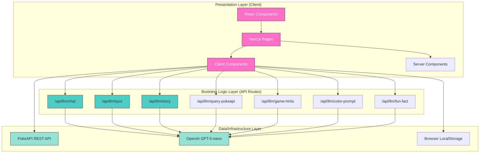
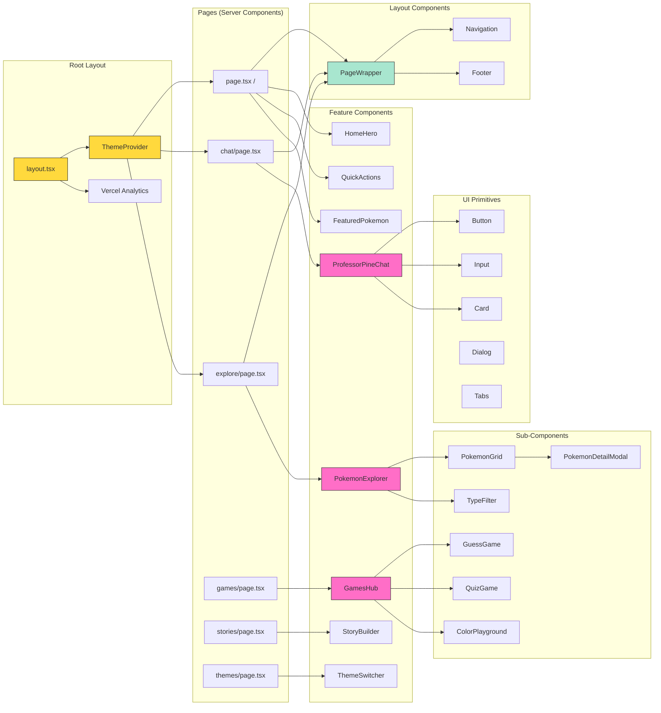
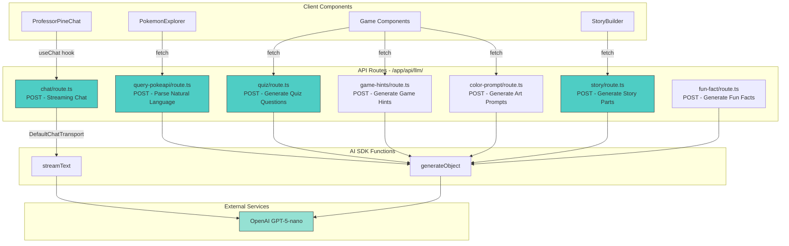
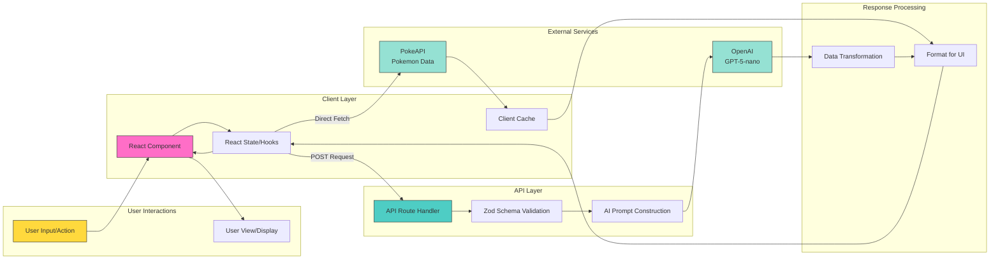
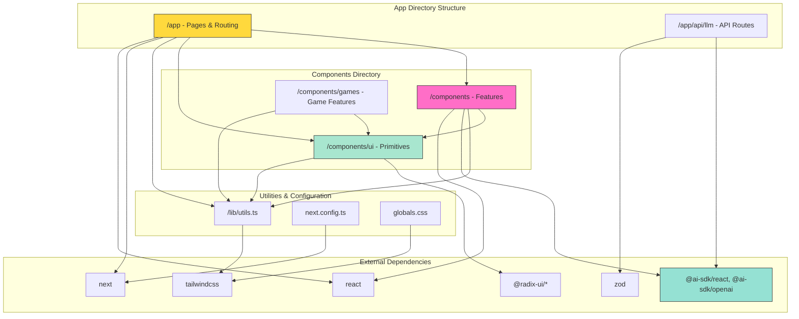
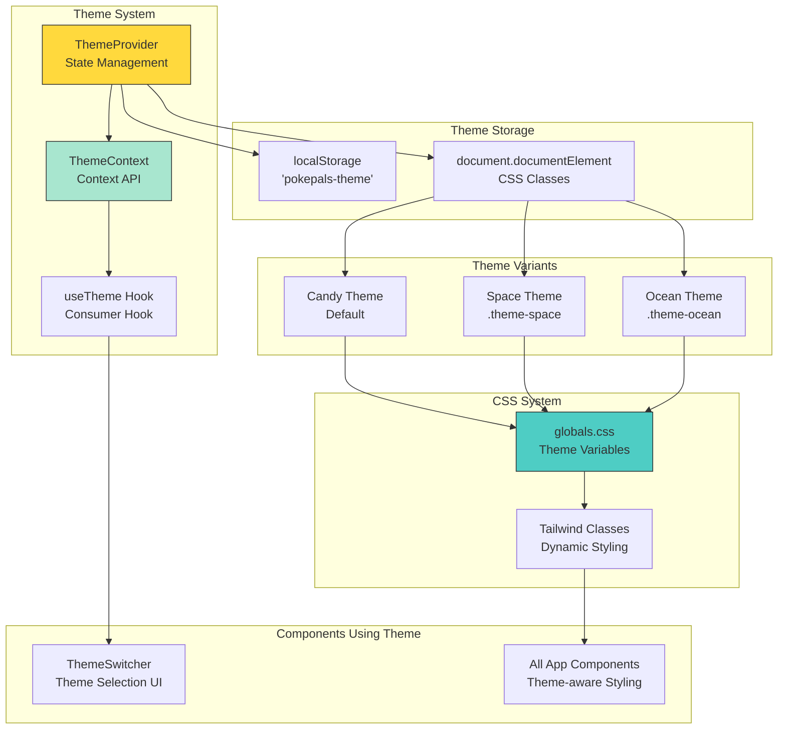
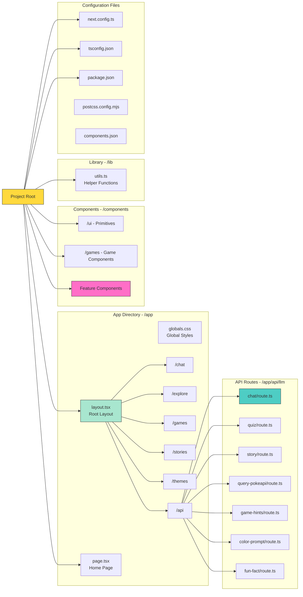

# Architecture Diagrams

## Overview

PokePals Interactive is a Next.js 16 web application built with TypeScript and React 19, designed as a kid-friendly Pokemon exploration platform. The architecture follows a modern JAMstack pattern with Server-Side Rendering (SSR), API Routes, and AI-powered features using OpenAI's GPT models. The application integrates with the external PokeAPI for Pokemon data and implements a custom theming system with multiple visual themes (candy, space, ocean).

**Key Technologies:**
- **Framework:** Next.js 16.0.3 with App Router
- **UI:** React 19.2.0, Radix UI components, Tailwind CSS 4.1.9
- **AI Integration:** Vercel AI SDK (@ai-sdk/openai, @ai-sdk/react)
- **External API:** PokeAPI (https://pokeapi.co)
- **Styling:** Tailwind CSS with custom theming, tailwindcss-animate
- **Type Safety:** TypeScript with Zod schema validation

## System Architecture

### Description

The application follows a three-tier layered architecture:

1. **Presentation Layer**: Client-side React components with Server Components and Client Components
2. **Business Logic Layer**: Next.js API Routes handling AI integration, data transformation, and orchestration
3. **Data/Infrastructure Layer**: External API integrations (PokeAPI, OpenAI) and client-side state management

## Component Relationships

### Description

The component hierarchy demonstrates a clear separation between layout components, feature components, and UI primitives. The PageWrapper provides consistent layout structure, while feature components (ProfessorPineChat, PokemonExplorer, GamesHub, StoryBuilder) encapsulate specific functionality. The application uses both Server Components (pages, layout) and Client Components (interactive features).

## API Route Architecture

### Description

The API layer is organized around AI-powered features, with each route handling specific LLM interactions. All routes use OpenAI's GPT-5-nano model through the Vercel AI SDK. Routes employ either streaming responses (chat) or structured object generation (quiz, story, hints) using Zod schemas for type safety.

## Data Flow

### Description

The application implements multiple data flow patterns:

1. **Pokemon Data Flow**: Direct client-to-PokeAPI requests with client-side caching and pagination
2. **AI Chat Flow**: Streaming responses from OpenAI via Server-Side API route
3. **AI Generation Flow**: Structured object generation with Zod schema validation
4. **Theme Management**: Client-side state with localStorage persistence

## Module Dependencies

### Description

The codebase uses a modular structure with clear dependency patterns. The @/ alias maps to the project root, enabling clean imports. UI primitives from /components/ui are consumed by feature components, which are then composed into pages. All TypeScript files maintain strict type safety with interface definitions.

## Theming Architecture

### Description

The application implements a custom theming system using React Context and CSS custom properties. Three themes (candy, space, ocean) are available, with theme state persisted in localStorage. The ThemeProvider wraps the entire application and manages theme switching through CSS class application.

## AI Integration Architecture

### Description

All AI features use the Vercel AI SDK with OpenAI's GPT-5-nano model. The architecture separates concerns between streaming responses (chat) and structured generation (games, stories). Each API route implements specific prompt engineering and safety filters for kid-friendly content.

```mermaid
graph TB
    subgraph "AI-Powered Features"
        Chat[Professor Pine Chat<br/>Conversational AI]
        NLSearch[Natural Language Search<br/>Query Understanding]
        Quiz[Quiz Generation<br/>Structured Output]
        Story[Story Builder<br/>Structured Output]
        Hints[Game Hints<br/>Structured Output]
        Color[Color Prompts<br/>Structured Output]
        Facts[Fun Facts<br/>Structured Output]
    end

    subgraph "AI SDK Integration"
        StreamText["streamText()<br/>Streaming Responses"]
        GenObject["generateObject()<br/>Zod Schema Validation"]
        UIStream["toUIMessageStreamResponse()<br/>React Hook Compatible"]
    end

    subgraph "Schema Definitions"
        QuizSchema[quizSchema<br/>Questions Array]
        StorySchema[storyResponseSchema<br/>Text + Choices]
        HintsSchema[hintsSchema<br/>3 Hints Array]
        SearchSchema[searchFiltersSchema<br/>Types + IDs]
    end

    subgraph "Prompt Engineering"
        SystemPrompts[System Prompts<br/>Role Definition]
        SafetyFilters[Content Safety<br/>Kid-Friendly Rules]
        Fallbacks[Error Fallbacks<br/>Default Responses]
    end

    subgraph "OpenAI Service"
        GPT5Nano[GPT-5-nano Model<br/>Fast, Cost-Effective]
    end

    Chat --> StreamText
    NLSearch --> GenObject
    Quiz --> GenObject
    Story --> GenObject
    Hints --> GenObject
    Color --> GenObject
    Facts --> GenObject

    StreamText --> UIStream
    StreamText --> GPT5Nano
    GenObject --> GPT5Nano

    GenObject --> QuizSchema
    GenObject --> StorySchema
    GenObject --> HintsSchema
    GenObject --> SearchSchema

    Chat --> SystemPrompts
    Chat --> SafetyFilters
    Quiz --> SystemPrompts
    Story --> SystemPrompts

    Chat --> Fallbacks
    Quiz --> Fallbacks
    Story --> Fallbacks

    style Chat fill:#ff6ec7,stroke:#333,color:#fff
    style StreamText fill:#4ecdc4,stroke:#333
    style GenObject fill:#4ecdc4,stroke:#333
    style GPT5Nano fill:#95e1d3,stroke:#333
```

## File Organization

### Description

The project follows Next.js 16 App Router conventions with clear separation between server and client code. The /app directory contains pages and API routes, /components holds all UI components, and /lib contains utilities. Configuration files are at the root level.

## Key Files Reference

### Pages & Routing
- `app/layout.tsx` - Root layout with ThemeProvider
- `app/page.tsx` - Home page composition
- `app/chat/page.tsx` - Chat interface page
- `app/explore/page.tsx` - Pokemon explorer page
- `app/games/page.tsx` - Games hub page
- `app/stories/page.tsx` - Story builder page
- `app/themes/page.tsx` - Theme switcher page

### API Routes
- `app/api/llm/chat/route.ts` - Streaming chat with Professor Pine
- `app/api/llm/quiz/route.ts` - Quiz question generation
- `app/api/llm/story/route.ts` - Interactive story generation
- `app/api/llm/query-pokeapi/route.ts` - Natural language Pokemon search
- `app/api/llm/game-hints/route.ts` - Guessing game hint generation
- `app/api/llm/color-prompt/route.ts` - Art prompt generation
- `app/api/llm/fun-fact/route.ts` - Fun fact generation

### Feature Components
- `components/professor-pine-chat.tsx` - AI chat interface (lines 1-198)
- `components/pokemon-explorer.tsx` - Pokemon browsing/search (lines 1-123)
- `components/pokemon-grid.tsx` - Pokemon card grid with PokeAPI integration (lines 1-160)
- `components/games-hub.tsx` - Game selection hub (lines 1-70)
- `components/story-builder.tsx` - Interactive story builder (lines 1-206)
- `components/theme-provider.tsx` - Theme context provider (lines 1-47)
- `components/theme-switcher.tsx` - Theme selection UI
- `components/home-hero.tsx` - Homepage hero section
- `components/quick-actions.tsx` - Homepage quick navigation
- `components/featured-pokemon.tsx` - Featured Pokemon showcase

### Game Components
- `components/games/guess-game.tsx` - "Who's That Creature" game (lines 1-219)
- `components/games/quiz-game.tsx` - Quiz game component
- `components/games/color-playground.tsx` - Art prompt game

### Layout Components
- `components/page-wrapper.tsx` - Consistent page layout wrapper
- `components/navigation.tsx` - Navigation component
- `components/footer.tsx` - Footer component

### Supporting Components
- `components/pokemon-detail-modal.tsx` - Pokemon detail modal
- `components/type-filter.tsx` - Pokemon type filter

### UI Primitives
- `components/ui/button.tsx` - Button component
- `components/ui/card.tsx` - Card component
- `components/ui/input.tsx` - Input component
- `components/ui/dialog.tsx` - Dialog component
- `components/ui/tabs.tsx` - Tabs component

### Configuration & Utils
- `lib/utils.ts` - Utility functions (cn helper)
- `next.config.ts` - Next.js configuration
- `tsconfig.json` - TypeScript configuration
- `package.json` - Project dependencies
- `app/globals.css` - Global styles and theme variables

## Architecture Patterns

### 1. Server Components vs Client Components
- **Server Components**: All page files (page.tsx) for initial SSR
- **Client Components**: Interactive features marked with "use client" directive
- **Pattern**: Server Components fetch data, Client Components handle interactivity

### 2. API Route Pattern
- **Location**: /app/api/llm/* for all AI endpoints
- **Method**: POST requests with JSON payloads
- **Response Types**: Streaming (chat) or JSON (structured generation)
- **Error Handling**: Try-catch with fallback responses

### 3. State Management
- **Local State**: useState for component-level state
- **Context**: ThemeProvider for global theme state
- **External State**: Direct API calls with client-side caching
- **No Redux/Zustand**: Simple state management sufficient for app scope

### 4. Styling Strategy
- **Base**: Tailwind CSS with custom configuration
- **Theming**: CSS custom properties with class-based switching
- **Component Library**: Radix UI primitives with custom styling
- **Animations**: tailwindcss-animate for transitions

### 5. Type Safety
- **TypeScript**: Strict mode enabled throughout
- **Zod Schemas**: Runtime validation for AI responses
- **Interface Definitions**: Explicit types for Pokemon, components, props
- **Path Aliases**: @/ alias for clean imports

### 6. Performance Optimizations
- **Image Optimization**: Next.js Image component with remote patterns
- **Code Splitting**: Automatic via Next.js App Router
- **SSR**: Server-side rendering for initial page loads
- **Client Caching**: Pokemon data cached in component state

### 7. Security & Safety
- **Content Filtering**: Regex-based blocked patterns in chat
- **Kid-Friendly Prompts**: System prompts enforce appropriate content
- **Environment Variables**: API keys in .env.local
- **No Direct DB**: Stateless architecture, no sensitive data storage
