# Data Flow Analysis

## Overview

This document describes the main data flows in the Poke Pals Interactive application, a Next.js-based web application that provides an interactive Pokemon exploration experience for children. The application follows a modern client-server architecture with:

- **Frontend**: React components using Next.js 14 App Router
- **Backend**: Next.js API routes serving as middleware
- **External Services**:
  - PokeAPI for Pokemon data
  - OpenAI API (via Vercel AI SDK) for AI-powered features
- **Data Flow Pattern**: Client-initiated requests flow through API routes to external services, with responses streaming back to the client

Key architectural patterns:
- Server-side API routes act as secure proxies to external services
- Streaming responses for real-time AI interactions
- Client-side state management for interactive sessions
- Type-safe data handling with TypeScript and Zod validation

## Query Flow

### Description

The basic query flow handles user interactions with Pokemon data. When users search or browse Pokemon, the flow starts at the client component, fetches data from PokeAPI through direct HTTP calls, and renders the results. This is the most common data flow pattern in the application.

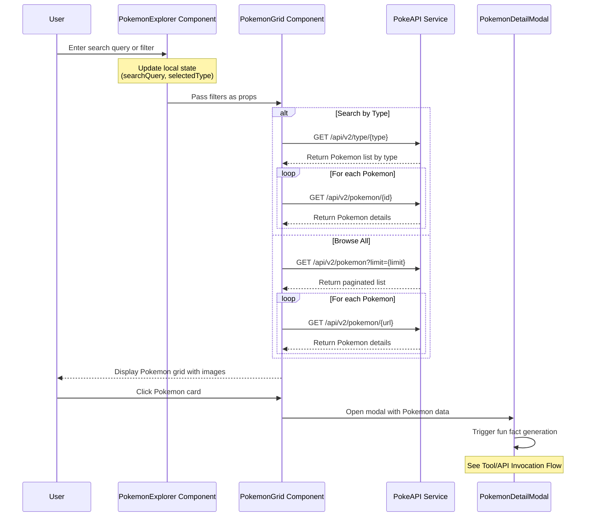
```mermaid
sequenceDiagram
    participant User
    participant PokemonExplorer as PokemonExplorer Component
    participant PokemonGrid as PokemonGrid Component
    participant PokeAPI as PokeAPI Service

    User->>PokemonExplorer: Enter search query or filter
    Note over PokemonExplorer: Update local state<br/>(searchQuery, selectedType)
    PokemonExplorer->>PokemonGrid: Pass filters as props

    alt Search by Type
        PokemonGrid->>PokeAPI: GET /api/v2/type/{type}
        PokeAPI-->>PokemonGrid: Return Pokemon list by type
        loop For each Pokemon
            PokemonGrid->>PokeAPI: GET /api/v2/pokemon/{id}
            PokeAPI-->>PokemonGrid: Return Pokemon details
        end
    else Browse All
        PokemonGrid->>PokeAPI: GET /api/v2/pokemon?limit={limit}
        PokeAPI-->>PokemonGrid: Return paginated list
        loop For each Pokemon
            PokemonGrid->>PokeAPI: GET /api/v2/pokemon/{url}
            PokeAPI-->>PokemonGrid: Return Pokemon details
        end
    end

    PokemonGrid-->>User: Display Pokemon grid with images

    User->>PokemonGrid: Click Pokemon card
    PokemonGrid->>PokemonDetailModal: Open modal with Pokemon data
    PokemonDetailModal->>PokemonDetailModal: Trigger fun fact generation
    Note over PokemonDetailModal: See Tool/API Invocation Flow
```

### Key Files Involved

- `components/pokemon-explorer.tsx` (lines 1-123)
  - Main explorer component managing search/filter state
  - Handles tab switching between browse and AI search modes
  - Lines 19-39: Natural language search handler

- `components/pokemon-grid.tsx` (lines 1-160)
  - Grid rendering component with pagination
  - Lines 59-94: Main data fetching logic with three modes (by ID, by type, paginated)
  - Lines 97: Client-side filtering by search query

- `components/pokemon-detail-modal.tsx` (lines 1-150)
  - Modal component for detailed Pokemon view
  - Lines 60-79: AI-powered fun fact generation

### Data Flow Details

1. **State Management**: Client-side React state (useState) manages search queries and filters
2. **API Communication**: Direct fetch calls to PokeAPI (https://pokeapi.co/api/v2/)
3. **Data Transformation**: Pokemon data mapped to UI-friendly format with type colors
4. **Performance**: Pagination (20 items per page), lazy loading with "Load More" button

## Interactive Client Session Flow

### Description

Interactive sessions maintain conversational context over multiple exchanges. The chat interface with Professor Pine uses Vercel AI SDK's `useChat` hook to manage streaming message sessions, preserving conversation history and handling real-time AI responses.

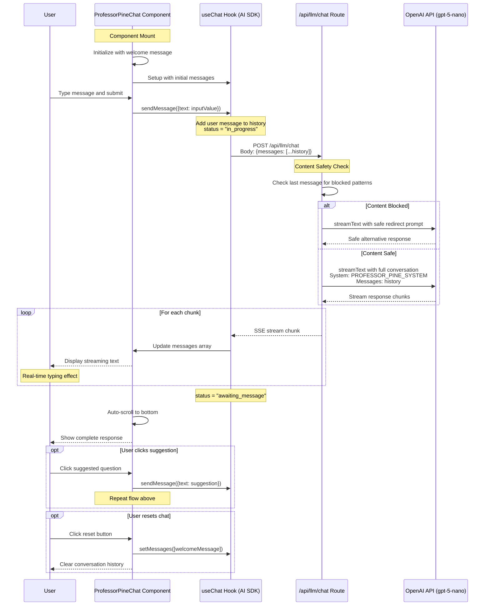
```mermaid
sequenceDiagram
    participant User
    participant ProfessorPineChat as ProfessorPineChat Component
    participant useChat as useChat Hook (AI SDK)
    participant ChatAPI as /api/llm/chat Route
    participant OpenAI as OpenAI API (gpt-5-nano)

    Note over ProfessorPineChat: Component Mount
    ProfessorPineChat->>ProfessorPineChat: Initialize with welcome message
    ProfessorPineChat->>useChat: Setup with initial messages

    User->>ProfessorPineChat: Type message and submit
    ProfessorPineChat->>useChat: sendMessage({text: inputValue})
    Note over useChat: Add user message to history<br/>status = "in_progress"

    useChat->>ChatAPI: POST /api/llm/chat<br/>Body: {messages: [...history]}

    Note over ChatAPI: Content Safety Check
    ChatAPI->>ChatAPI: Check last message for blocked patterns

    alt Content Blocked
        ChatAPI->>OpenAI: streamText with safe redirect prompt
        OpenAI-->>ChatAPI: Safe alternative response
    else Content Safe
        ChatAPI->>OpenAI: streamText with full conversation<br/>System: PROFESSOR_PINE_SYSTEM<br/>Messages: history
        OpenAI-->>ChatAPI: Stream response chunks
    end

    loop For each chunk
        ChatAPI-->>useChat: SSE stream chunk
        useChat->>ProfessorPineChat: Update messages array
        ProfessorPineChat-->>User: Display streaming text
        Note over User: Real-time typing effect
    end

    Note over useChat: status = "awaiting_message"
    ProfessorPineChat->>ProfessorPineChat: Auto-scroll to bottom
    ProfessorPineChat-->>User: Show complete response

    opt User clicks suggestion
        User->>ProfessorPineChat: Click suggested question
        ProfessorPineChat->>useChat: sendMessage({text: suggestion})
        Note over ProfessorPineChat: Repeat flow above
    end

    opt User resets chat
        User->>ProfessorPineChat: Click reset button
        ProfessorPineChat->>useChat: setMessages([welcomeMessage])
        ProfessorPineChat-->>User: Clear conversation history
    end
```

### Key Files Involved

- `components/professor-pine-chat.tsx` (lines 1-198)
  - Lines 26-42: useChat hook initialization with DefaultChatTransport
  - Lines 28-40: Initial welcome message setup
  - Lines 52-58: Form submission handler
  - Lines 64-79: Reset conversation handler
  - Lines 44-50: Auto-scroll effect on new messages

- `app/api/llm/chat/route.ts` (lines 1-70)
  - Lines 6-35: PROFESSOR_PINE_SYSTEM prompt defining personality
  - Lines 37-57: Request processing with safety checks
  - Lines 40-56: Content filtering and safe response generation
  - Lines 59-68: Main streaming text generation with OpenAI

### Session State Management

1. **Client State**: `useChat` hook maintains messages array and status
2. **Conversation History**: All messages persisted in client state for context
3. **Streaming**: Server-Sent Events (SSE) for real-time response delivery
4. **Safety Layer**: Server-side content filtering before AI processing
5. **Status Tracking**: "in_progress" vs "awaiting_message" states control UI

## Tool/API Invocation Flow

### Description

The application invokes AI tools/APIs for various features including natural language search, quiz generation, story creation, and fun fact generation. Each invocation follows a structured pattern with Zod schema validation and error handling fallbacks.

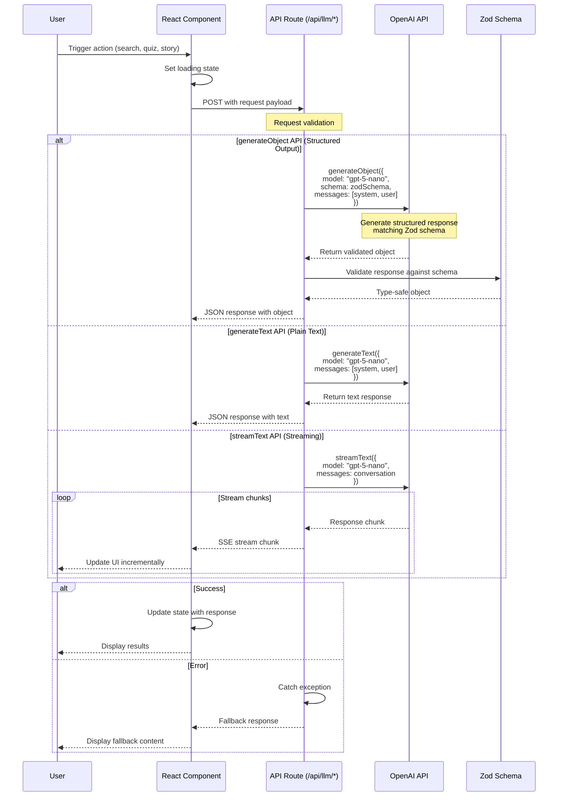
```mermaid
sequenceDiagram
    participant User
    participant Component as React Component
    participant APIRoute as API Route (/api/llm/*)
    participant OpenAI as OpenAI API
    participant Zod as Zod Schema

    User->>Component: Trigger action (search, quiz, story)
    Component->>Component: Set loading state

    Component->>APIRoute: POST with request payload
    Note over APIRoute: Request validation

    alt generateObject API (Structured Output)
        APIRoute->>OpenAI: generateObject({<br/>  model: "gpt-5-nano",<br/>  schema: zodSchema,<br/>  messages: [system, user]<br/>})
        Note over OpenAI: Generate structured response<br/>matching Zod schema
        OpenAI-->>APIRoute: Return validated object
        APIRoute->>Zod: Validate response against schema
        Zod-->>APIRoute: Type-safe object
        APIRoute-->>Component: JSON response with object
    else generateText API (Plain Text)
        APIRoute->>OpenAI: generateText({<br/>  model: "gpt-5-nano",<br/>  messages: [system, user]<br/>})
        OpenAI-->>APIRoute: Return text response
        APIRoute-->>Component: JSON response with text
    else streamText API (Streaming)
        APIRoute->>OpenAI: streamText({<br/>  model: "gpt-5-nano",<br/>  messages: conversation<br/>})
        loop Stream chunks
            OpenAI-->>APIRoute: Response chunk
            APIRoute-->>Component: SSE stream chunk
            Component-->>User: Update UI incrementally
        end
    end

    alt Success
        Component->>Component: Update state with response
        Component-->>User: Display results
    else Error
        APIRoute->>APIRoute: Catch exception
        APIRoute-->>Component: Fallback response
        Component-->>User: Display fallback content
    end
```

### Specific Tool Flows

#### 1. Natural Language Pokemon Search

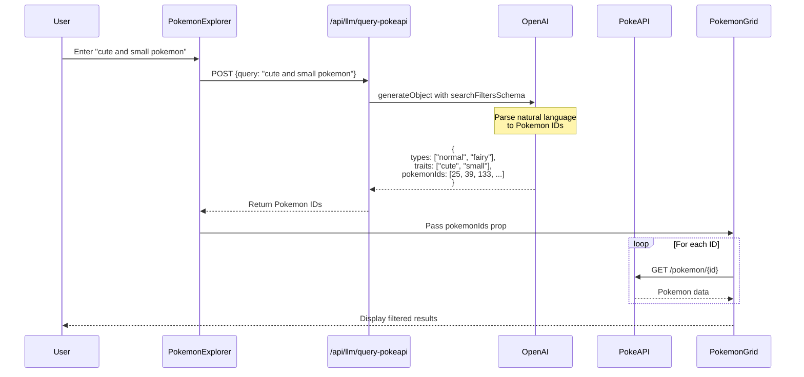
```mermaid
sequenceDiagram
    participant User
    participant PokemonExplorer
    participant QueryAPI as /api/llm/query-pokeapi
    participant OpenAI
    participant PokeAPI
    participant PokemonGrid

    User->>PokemonExplorer: Enter "cute and small pokemon"
    PokemonExplorer->>QueryAPI: POST {query: "cute and small pokemon"}
    QueryAPI->>OpenAI: generateObject with searchFiltersSchema
    Note over OpenAI: Parse natural language<br/>to Pokemon IDs
    OpenAI-->>QueryAPI: {<br/>  types: ["normal", "fairy"],<br/>  traits: ["cute", "small"],<br/>  pokemonIds: [25, 39, 133, ...]<br/>}
    QueryAPI-->>PokemonExplorer: Return Pokemon IDs
    PokemonExplorer->>PokemonGrid: Pass pokemonIds prop
    loop For each ID
        PokemonGrid->>PokeAPI: GET /pokemon/{id}
        PokeAPI-->>PokemonGrid: Pokemon data
    end
    PokemonGrid-->>User: Display filtered results
```

#### 2. Quiz Generation

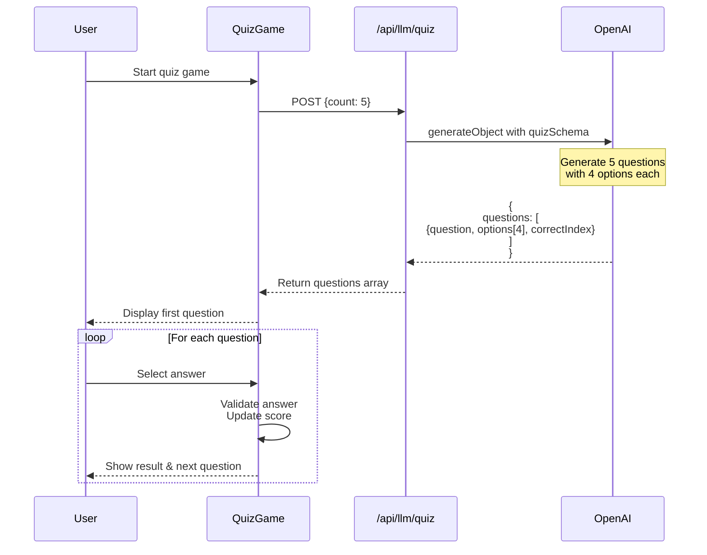
```mermaid
sequenceDiagram
    participant User
    participant QuizGame
    participant QuizAPI as /api/llm/quiz
    participant OpenAI

    User->>QuizGame: Start quiz game
    QuizGame->>QuizAPI: POST {count: 5}
    QuizAPI->>OpenAI: generateObject with quizSchema
    Note over OpenAI: Generate 5 questions<br/>with 4 options each
    OpenAI-->>QuizAPI: {<br/>  questions: [<br/>    {question, options[4], correctIndex}<br/>  ]<br/>}
    QuizAPI-->>QuizGame: Return questions array
    QuizGame-->>User: Display first question

    loop For each question
        User->>QuizGame: Select answer
        QuizGame->>QuizGame: Validate answer<br/>Update score
        QuizGame-->>User: Show result & next question
    end
```

#### 3. Interactive Story Building

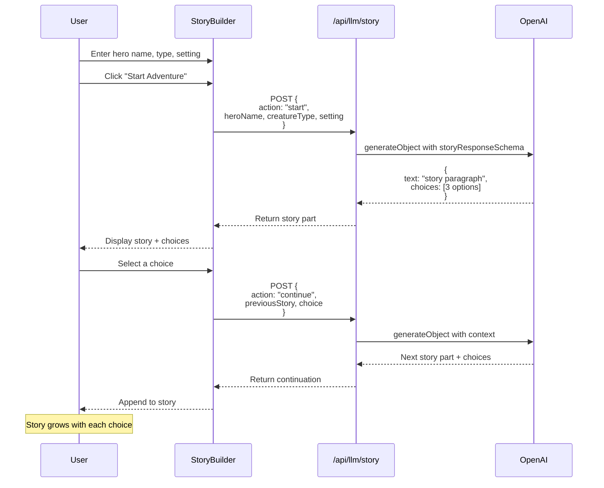
```mermaid
sequenceDiagram
    participant User
    participant StoryBuilder
    participant StoryAPI as /api/llm/story
    participant OpenAI

    User->>StoryBuilder: Enter hero name, type, setting
    User->>StoryBuilder: Click "Start Adventure"
    StoryBuilder->>StoryAPI: POST {<br/>  action: "start",<br/>  heroName, creatureType, setting<br/>}
    StoryAPI->>OpenAI: generateObject with storyResponseSchema
    OpenAI-->>StoryAPI: {<br/>  text: "story paragraph",<br/>  choices: [3 options]<br/>}
    StoryAPI-->>StoryBuilder: Return story part
    StoryBuilder-->>User: Display story + choices

    User->>StoryBuilder: Select a choice
    StoryBuilder->>StoryAPI: POST {<br/>  action: "continue",<br/>  previousStory, choice<br/>}
    StoryAPI->>OpenAI: generateObject with context
    OpenAI-->>StoryAPI: Next story part + choices
    StoryAPI-->>StoryBuilder: Return continuation
    StoryBuilder-->>User: Append to story

    Note over User: Story grows with each choice
```

### Key Files Involved

**Query/Search API**:
- `app/api/llm/query-pokeapi/route.ts` (lines 1-57)
  - Lines 5-9: Zod schema defining search filters structure
  - Lines 15-43: generateObject call with system prompt
  - Lines 46-54: Fallback to random Pokemon on error

**Quiz API**:
- `app/api/llm/quiz/route.ts` (lines 1-85)
  - Lines 5-13: Zod schema for quiz questions
  - Lines 19-47: generateObject with quiz generation prompt
  - Lines 52-82: Fallback hardcoded questions

**Story API**:
- `app/api/llm/story/route.ts` (lines 1-78)
  - Lines 5-8: Zod schema for story response
  - Lines 14-41: Start story action handler
  - Lines 42-68: Continue story action handler

**Fun Fact API**:
- `app/api/llm/fun-fact/route.ts` (lines 1-40)
  - Lines 8-29: generateText for simple text response
  - Lines 34-37: Fallback fun fact

**Game Hints API**:
- `app/api/llm/game-hints/route.ts` (lines 1-47)
  - Lines 5-7: Zod schema for hints array
  - Lines 13-33: Generate progressive hints

**Color Prompt API**:
- `app/api/llm/color-prompt/route.ts` (lines 1-49)
  - Lines 5-8: Zod schema for prompt and colors
  - Lines 12-37: Generate creative drawing prompts

### Tool Invocation Patterns

1. **Request Validation**: All requests include type-safe parameters
2. **Schema Enforcement**: Zod schemas ensure OpenAI returns valid structures
3. **Error Handling**: Try-catch blocks with meaningful fallbacks
4. **Timeout Protection**: maxOutputTokens limit (3000) prevents runaway requests
5. **Model Selection**: Consistent use of "gpt-5-nano" model across all features

## External Service Communication Flow

### Description

The application integrates with two primary external services: PokeAPI for Pokemon data and OpenAI API for AI-powered features. The communication patterns differ based on service requirements.

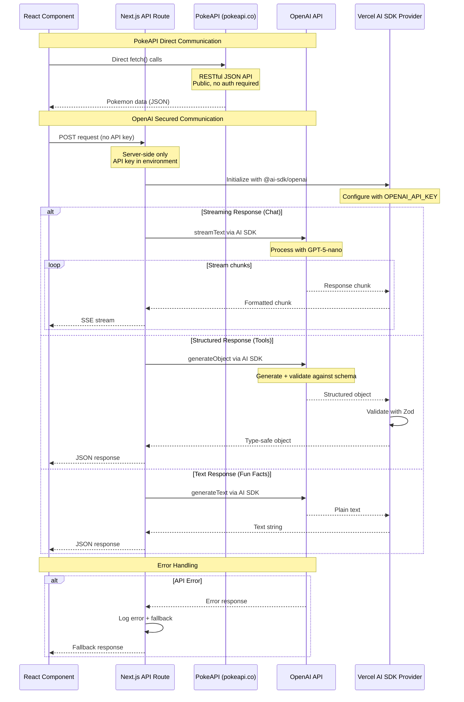
```mermaid
sequenceDiagram
    participant Client as React Component
    participant APIRoute as Next.js API Route
    participant PokeAPI as PokeAPI (pokeapi.co)
    participant OpenAI as OpenAI API
    participant AISDKProvider as Vercel AI SDK Provider

    Note over Client,OpenAI: PokeAPI Direct Communication
    Client->>PokeAPI: Direct fetch() calls
    Note over PokeAPI: RESTful JSON API<br/>Public, no auth required
    PokeAPI-->>Client: Pokemon data (JSON)

    Note over Client,OpenAI: OpenAI Secured Communication
    Client->>APIRoute: POST request (no API key)
    Note over APIRoute: Server-side only<br/>API key in environment

    APIRoute->>AISDKProvider: Initialize with @ai-sdk/openai
    Note over AISDKProvider: Configure with OPENAI_API_KEY

    alt Streaming Response (Chat)
        APIRoute->>OpenAI: streamText via AI SDK
        Note over OpenAI: Process with GPT-5-nano
        loop Stream chunks
            OpenAI-->>AISDKProvider: Response chunk
            AISDKProvider-->>APIRoute: Formatted chunk
            APIRoute-->>Client: SSE stream
        end
    else Structured Response (Tools)
        APIRoute->>OpenAI: generateObject via AI SDK
        Note over OpenAI: Generate + validate against schema
        OpenAI-->>AISDKProvider: Structured object
        AISDKProvider->>AISDKProvider: Validate with Zod
        AISDKProvider-->>APIRoute: Type-safe object
        APIRoute-->>Client: JSON response
    else Text Response (Fun Facts)
        APIRoute->>OpenAI: generateText via AI SDK
        OpenAI-->>AISDKProvider: Plain text
        AISDKProvider-->>APIRoute: Text string
        APIRoute-->>Client: JSON response
    end

    Note over Client,OpenAI: Error Handling
    alt API Error
        OpenAI-->>APIRoute: Error response
        APIRoute->>APIRoute: Log error + fallback
        APIRoute-->>Client: Fallback response
    end
```

### PokeAPI Integration Details

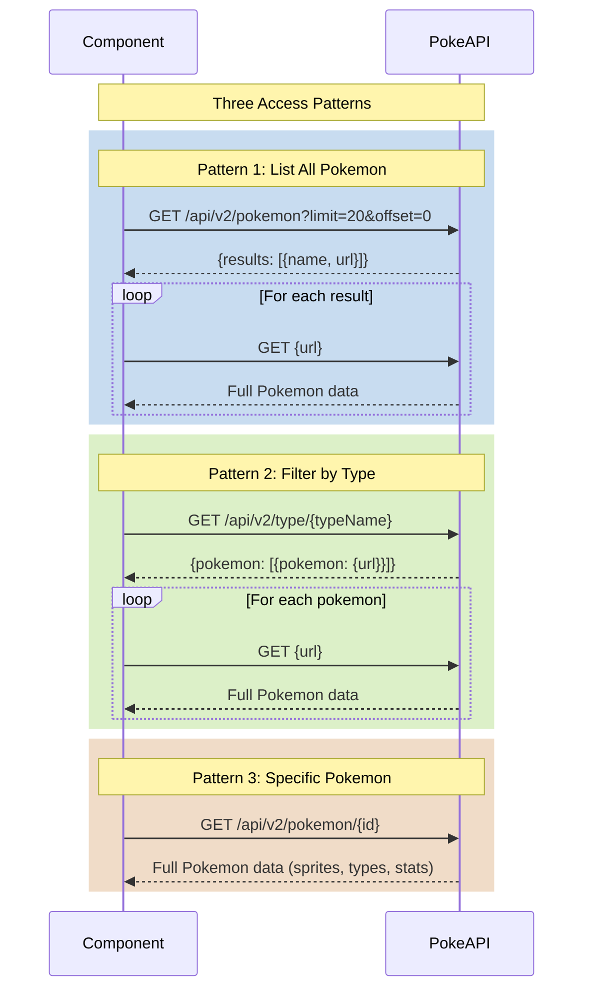
```mermaid
sequenceDiagram
    participant Component
    participant PokeAPI

    Note over Component,PokeAPI: Three Access Patterns

    rect rgb(200, 220, 240)
        Note over Component,PokeAPI: Pattern 1: List All Pokemon
        Component->>PokeAPI: GET /api/v2/pokemon?limit=20&offset=0
        PokeAPI-->>Component: {results: [{name, url}]}
        loop For each result
            Component->>PokeAPI: GET {url}
            PokeAPI-->>Component: Full Pokemon data
        end
    end

    rect rgb(220, 240, 200)
        Note over Component,PokeAPI: Pattern 2: Filter by Type
        Component->>PokeAPI: GET /api/v2/type/{typeName}
        PokeAPI-->>Component: {pokemon: [{pokemon: {url}}]}
        loop For each pokemon
            Component->>PokeAPI: GET {url}
            PokeAPI-->>Component: Full Pokemon data
        end
    end

    rect rgb(240, 220, 200)
        Note over Component,PokeAPI: Pattern 3: Specific Pokemon
        Component->>PokeAPI: GET /api/v2/pokemon/{id}
        PokeAPI-->>Component: Full Pokemon data (sprites, types, stats)
    end
```

### OpenAI API Integration Details

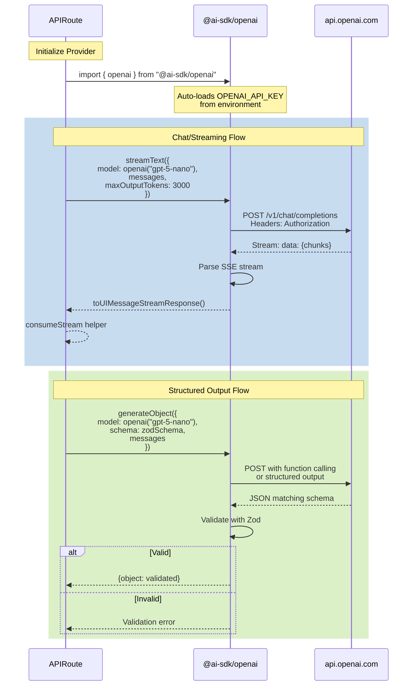
```mermaid
sequenceDiagram
    participant APIRoute
    participant AISDKProvider as @ai-sdk/openai
    participant OpenAI as api.openai.com

    Note over APIRoute: Initialize Provider
    APIRoute->>AISDKProvider: import { openai } from "@ai-sdk/openai"
    Note over AISDKProvider: Auto-loads OPENAI_API_KEY<br/>from environment

    rect rgb(200, 220, 240)
        Note over APIRoute,OpenAI: Chat/Streaming Flow
        APIRoute->>AISDKProvider: streamText({<br/>  model: openai("gpt-5-nano"),<br/>  messages,<br/>  maxOutputTokens: 3000<br/>})
        AISDKProvider->>OpenAI: POST /v1/chat/completions<br/>Headers: Authorization
        OpenAI-->>AISDKProvider: Stream: data: {chunks}
        AISDKProvider->>AISDKProvider: Parse SSE stream
        AISDKProvider-->>APIRoute: toUIMessageStreamResponse()
        APIRoute-->>APIRoute: consumeStream helper
    end

    rect rgb(220, 240, 200)
        Note over APIRoute,OpenAI: Structured Output Flow
        APIRoute->>AISDKProvider: generateObject({<br/>  model: openai("gpt-5-nano"),<br/>  schema: zodSchema,<br/>  messages<br/>})
        AISDKProvider->>OpenAI: POST with function calling<br/>or structured output
        OpenAI-->>AISDKProvider: JSON matching schema
        AISDKProvider->>AISDKProvider: Validate with Zod
        alt Valid
            AISDKProvider-->>APIRoute: {object: validated}
        else Invalid
            AISDKProvider-->>APIRoute: Validation error
        end
    end
```

### Key Files Involved

**PokeAPI Integration** (Direct from client):
- `components/pokemon-grid.tsx`
  - Lines 65-68: Fetch specific Pokemon by IDs
  - Lines 69-77: Fetch by type filter
  - Lines 78-86: Fetch paginated list

- `components/games/guess-game.tsx`
  - Lines 41-44: Fetch random Pokemon for guessing game

**OpenAI Integration** (Via AI SDK):
- All API routes in `app/api/llm/`
  - Import pattern: `import { openai } from "@ai-sdk/openai"`
  - Import AI SDK functions: `streamText`, `generateObject`, `generateText`

### Service Communication Characteristics

**PokeAPI**:
- **Authentication**: None required (public API)
- **Rate Limiting**: Fair use policy, no hard limits documented
- **Response Format**: JSON with nested objects
- **Caching**: Could be improved with client-side caching
- **Error Handling**: Basic try-catch in components

**OpenAI API**:
- **Authentication**: API key via environment variable (OPENAI_API_KEY)
- **Security**: Key never exposed to client, server-side only
- **Rate Limiting**: Handled by OpenAI (based on account tier)
- **Response Formats**:
  - SSE streams for chat
  - JSON for structured outputs
  - Plain text for simple generations
- **Error Handling**: Try-catch with fallback responses

## Message Parsing and Routing

### Description

The application uses Next.js App Router for routing with file-based conventions. Message/request parsing varies by endpoint type - API routes parse JSON bodies while page routes handle URL parameters and React component state.

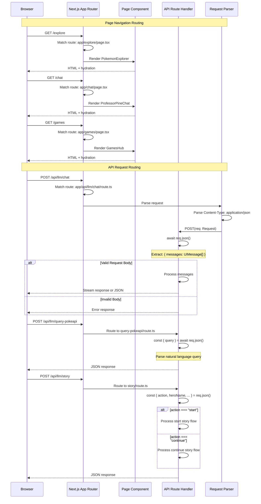
```mermaid
sequenceDiagram
    participant Browser
    participant NextRouter as Next.js App Router
    participant Page as Page Component
    participant APIRoute as API Route Handler
    participant Middleware as Request Parser

    Note over Browser,Middleware: Page Navigation Routing
    Browser->>NextRouter: GET /explore
    NextRouter->>NextRouter: Match route: app/explore/page.tsx
    NextRouter->>Page: Render PokemonExplorer
    Page-->>Browser: HTML + hydration

    Browser->>NextRouter: GET /chat
    NextRouter->>NextRouter: Match route: app/chat/page.tsx
    NextRouter->>Page: Render ProfessorPineChat
    Page-->>Browser: HTML + hydration

    Browser->>NextRouter: GET /games
    NextRouter->>NextRouter: Match route: app/games/page.tsx
    NextRouter->>Page: Render GamesHub
    Page-->>Browser: HTML + hydration

    Note over Browser,Middleware: API Request Routing
    Browser->>NextRouter: POST /api/llm/chat
    NextRouter->>NextRouter: Match route: app/api/llm/chat/route.ts
    NextRouter->>Middleware: Parse request

    Middleware->>Middleware: Parse Content-Type: application/json
    Middleware->>APIRoute: POST(req: Request)
    APIRoute->>APIRoute: await req.json()
    Note over APIRoute: Extract: { messages: UIMessage[] }

    alt Valid Request Body
        APIRoute->>APIRoute: Process messages
        APIRoute-->>Browser: Stream response or JSON
    else Invalid Body
        APIRoute-->>Browser: Error response
    end

    Browser->>NextRouter: POST /api/llm/query-pokeapi
    NextRouter->>APIRoute: Route to query-pokeapi/route.ts
    APIRoute->>APIRoute: const { query } = await req.json()
    Note over APIRoute: Parse natural language query
    APIRoute-->>Browser: JSON response

    Browser->>NextRouter: POST /api/llm/story
    NextRouter->>APIRoute: Route to story/route.ts
    APIRoute->>APIRoute: const { action, heroName, ... } = req.json()

    alt action === "start"
        APIRoute->>APIRoute: Process start story flow
    else action === "continue"
        APIRoute->>APIRoute: Process continue story flow
    end
    APIRoute-->>Browser: JSON response
```

### Route Structure and Parsing Details

```mermaid
graph TD
    A[Request] --> B{Request Type}

    B -->|Page Request| C[Page Routing]
    B -->|API Request| D[API Routing]

    C --> C1[/app/page.tsx]
    C --> C2[/app/chat/page.tsx]
    C --> C3[/app/explore/page.tsx]
    C --> C4[/app/games/page.tsx]
    C --> C5[/app/stories/page.tsx]
    C --> C6[/app/themes/page.tsx]

    D --> D1[/app/api/llm/chat/route.ts]
    D --> D2[/app/api/llm/query-pokeapi/route.ts]
    D --> D3[/app/api/llm/quiz/route.ts]
    D --> D4[/app/api/llm/story/route.ts]
    D --> D5[/app/api/llm/fun-fact/route.ts]
    D --> D6[/app/api/llm/game-hints/route.ts]
    D --> D7[/app/api/llm/color-prompt/route.ts]

    D1 --> D1P[Parse: messages UIMessage]
    D2 --> D2P[Parse: query string]
    D3 --> D3P[Parse: count number]
    D4 --> D4P[Parse: action, heroName, etc.]
    D5 --> D5P[Parse: name, types]
    D6 --> D6P[Parse: name, types, id]
    D7 --> D7P[No body - POST only]

    D1P --> E[Process & Respond]
    D2P --> E
    D3P --> E
    D4P --> E
    D5P --> E
    D6P --> E
    D7P --> E
```

### Request Parsing Patterns

#### 1. Chat API - Complex Message Array

File: `app/api/llm/chat/route.ts` (line 38)

```typescript
// Parse incoming message array
const { messages }: { messages: UIMessage[] } = await req.json()

// Extract last message for safety check
const lastMessage = messages[messages.length - 1]
const content = lastMessage?.parts?.map((p) => (p.type === "text" ? p.text : "")).join(" ") || ""

// Pattern matching for safety
const blockedPatterns = /\b(kill|hate|weapon|violence)\b/i
if (blockedPatterns.test(content)) {
  // Redirect to safe response
}

// Convert to model format
convertToModelMessages(messages)
```

#### 2. Query API - Simple String Extraction

File: `app/api/llm/query-pokeapi/route.ts` (line 12)

```typescript
// Parse natural language query
const { query } = await req.json()

// Forward to OpenAI for structured parsing
generateObject({
  schema: searchFiltersSchema,
  messages: [{ role: "user", content: query }]
})
```

#### 3. Story API - Action-Based Routing

File: `app/api/llm/story/route.ts` (line 11)

```typescript
// Parse story request with action discriminator
const { action, heroName, creatureType, setting, previousStory, choice } = await req.json()

// Route based on action type
if (action === "start") {
  // Handle story initialization
  generateObject({
    messages: [{ content: `Start a story where ${heroName}...` }]
  })
} else {
  // Handle story continuation
  generateObject({
    messages: [{ content: `Story so far:\n${previousStory}\n\nChose: "${choice}"` }]
  })
}
```

### Key Files Involved

**Route Configuration**:
- Next.js automatically maps filesystem to routes
- `app/` directory uses App Router conventions
- API routes export named functions: `POST`, `GET`, etc.

**Page Routes**:
- `app/page.tsx` - Homepage
- `app/chat/page.tsx` - Chat interface
- `app/explore/page.tsx` - Pokemon browser
- `app/games/page.tsx` - Games hub
- `app/stories/page.tsx` - Story builder
- `app/themes/page.tsx` - Theme customization

**API Routes** (all under `/app/api/llm/`):
- `chat/route.ts` - Streaming chat interface
- `query-pokeapi/route.ts` - Natural language Pokemon search
- `quiz/route.ts` - Quiz question generation
- `story/route.ts` - Interactive story building
- `fun-fact/route.ts` - Pokemon fun fact generation
- `game-hints/route.ts` - Guessing game hints
- `color-prompt/route.ts` - Drawing prompt generation

### Routing Characteristics

1. **File-Based Routing**: Routes determined by file structure
2. **Type Safety**: TypeScript ensures correct request/response types
3. **Method Handlers**: Each route exports HTTP method functions
4. **Request Parsing**: Standard `await req.json()` for POST bodies
5. **No Middleware**: Direct parsing in route handlers
6. **Client-Side Routing**: Next.js Link components for navigation
7. **API Proxy Pattern**: API routes act as secure proxies to external services

## Error Handling Flows

### Description

Error handling is implemented at multiple layers throughout the application, with graceful degradation to ensure the app remains functional even when services fail. Each layer has specific error handling strategies.

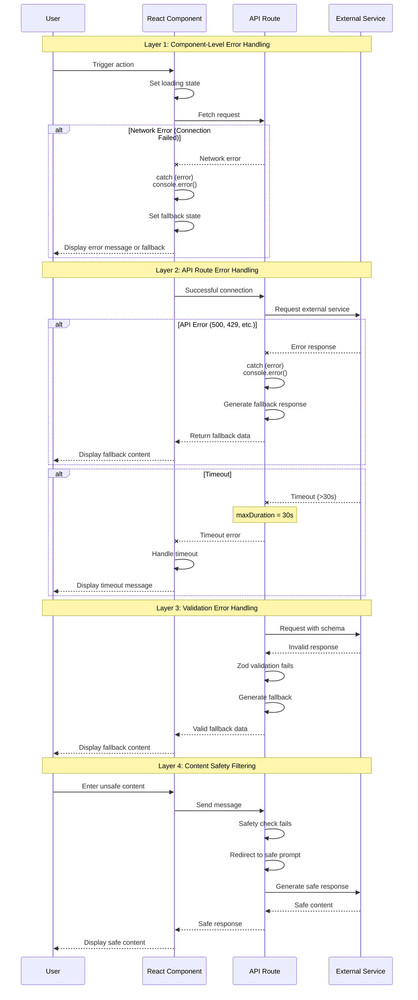
```mermaid
sequenceDiagram
    participant User
    participant Component as React Component
    participant APIRoute as API Route
    participant ExternalAPI as External Service

    Note over User,ExternalAPI: Layer 1: Component-Level Error Handling

    User->>Component: Trigger action
    Component->>Component: Set loading state
    Component->>APIRoute: Fetch request

    alt Network Error (Connection Failed)
        APIRoute--xComponent: Network error
        Component->>Component: catch (error)<br/>console.error()
        Component->>Component: Set fallback state
        Component-->>User: Display error message or fallback
    end

    Note over User,ExternalAPI: Layer 2: API Route Error Handling

    Component->>APIRoute: Successful connection
    APIRoute->>ExternalAPI: Request external service

    alt API Error (500, 429, etc.)
        ExternalAPI--xAPIRoute: Error response
        APIRoute->>APIRoute: catch (error)<br/>console.error()
        APIRoute->>APIRoute: Generate fallback response
        APIRoute-->>Component: Return fallback data
        Component-->>User: Display fallback content
    end

    alt Timeout
        ExternalAPI--xAPIRoute: Timeout (>30s)
        Note over APIRoute: maxDuration = 30s
        APIRoute--xComponent: Timeout error
        Component->>Component: Handle timeout
        Component-->>User: Display timeout message
    end

    Note over User,ExternalAPI: Layer 3: Validation Error Handling

    APIRoute->>ExternalAPI: Request with schema
    ExternalAPI-->>APIRoute: Invalid response
    APIRoute->>APIRoute: Zod validation fails
    APIRoute->>APIRoute: Generate fallback
    APIRoute-->>Component: Valid fallback data
    Component-->>User: Display fallback content

    Note over User,ExternalAPI: Layer 4: Content Safety Filtering

    User->>Component: Enter unsafe content
    Component->>APIRoute: Send message
    APIRoute->>APIRoute: Safety check fails
    APIRoute->>APIRoute: Redirect to safe prompt
    APIRoute->>ExternalAPI: Generate safe response
    ExternalAPI-->>APIRoute: Safe content
    APIRoute-->>Component: Safe response
    Component-->>User: Display safe content
```

### Specific Error Handling Patterns

#### 1. Chat API - Content Safety + Error Recovery

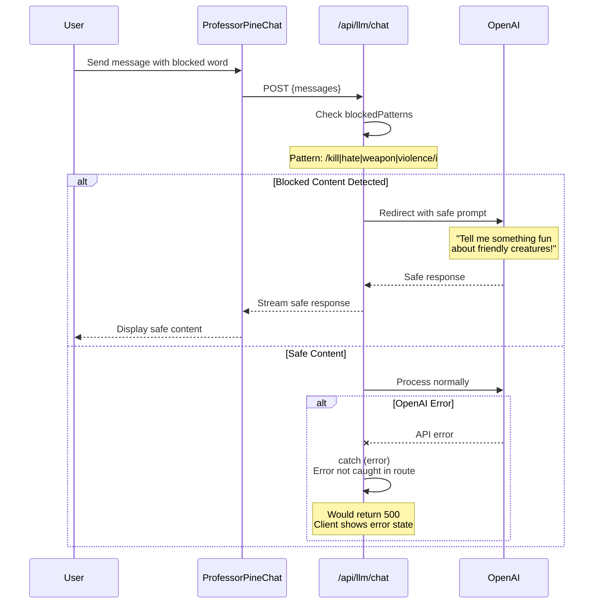
```mermaid
sequenceDiagram
    participant User
    participant Chat as ProfessorPineChat
    participant ChatAPI as /api/llm/chat
    participant OpenAI

    User->>Chat: Send message with blocked word
    Chat->>ChatAPI: POST {messages}
    ChatAPI->>ChatAPI: Check blockedPatterns
    Note over ChatAPI: Pattern: /kill|hate|weapon|violence/i

    alt Blocked Content Detected
        ChatAPI->>OpenAI: Redirect with safe prompt
        Note over OpenAI: "Tell me something fun<br/>about friendly creatures!"
        OpenAI-->>ChatAPI: Safe response
        ChatAPI-->>Chat: Stream safe response
        Chat-->>User: Display safe content
    else Safe Content
        ChatAPI->>OpenAI: Process normally
        alt OpenAI Error
            OpenAI--xChatAPI: API error
            ChatAPI->>ChatAPI: catch (error)<br/>Error not caught in route
            Note over ChatAPI: Would return 500<br/>Client shows error state
        end
    end
```

File: `app/api/llm/chat/route.ts`
- Lines 40-56: Content safety check with pattern matching
- No try-catch in this route (relies on AI SDK error handling)

#### 2. Query API - Fallback to Random Pokemon

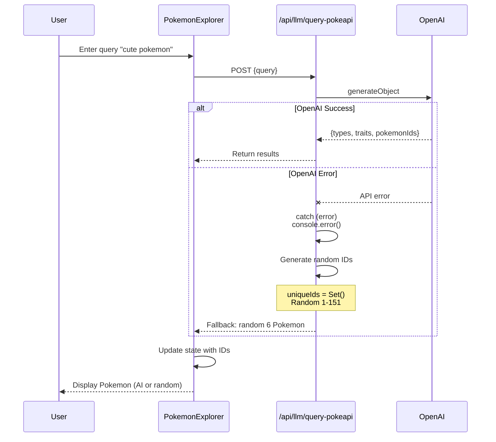
```mermaid
sequenceDiagram
    participant User
    participant Explorer as PokemonExplorer
    participant QueryAPI as /api/llm/query-pokeapi
    participant OpenAI

    User->>Explorer: Enter query "cute pokemon"
    Explorer->>QueryAPI: POST {query}
    QueryAPI->>OpenAI: generateObject

    alt OpenAI Success
        OpenAI-->>QueryAPI: {types, traits, pokemonIds}
        QueryAPI-->>Explorer: Return results
    else OpenAI Error
        OpenAI--xQueryAPI: API error
        QueryAPI->>QueryAPI: catch (error)<br/>console.error()
        QueryAPI->>QueryAPI: Generate random IDs
        Note over QueryAPI: uniqueIds = Set()<br/>Random 1-151
        QueryAPI-->>Explorer: Fallback: random 6 Pokemon
    end

    Explorer->>Explorer: Update state with IDs
    Explorer-->>User: Display Pokemon (AI or random)
```

File: `app/api/llm/query-pokeapi/route.ts`
- Lines 46-54: Comprehensive error handling with random fallback
- Ensures user always gets results even if AI fails

#### 3. Quiz API - Hardcoded Fallback Questions

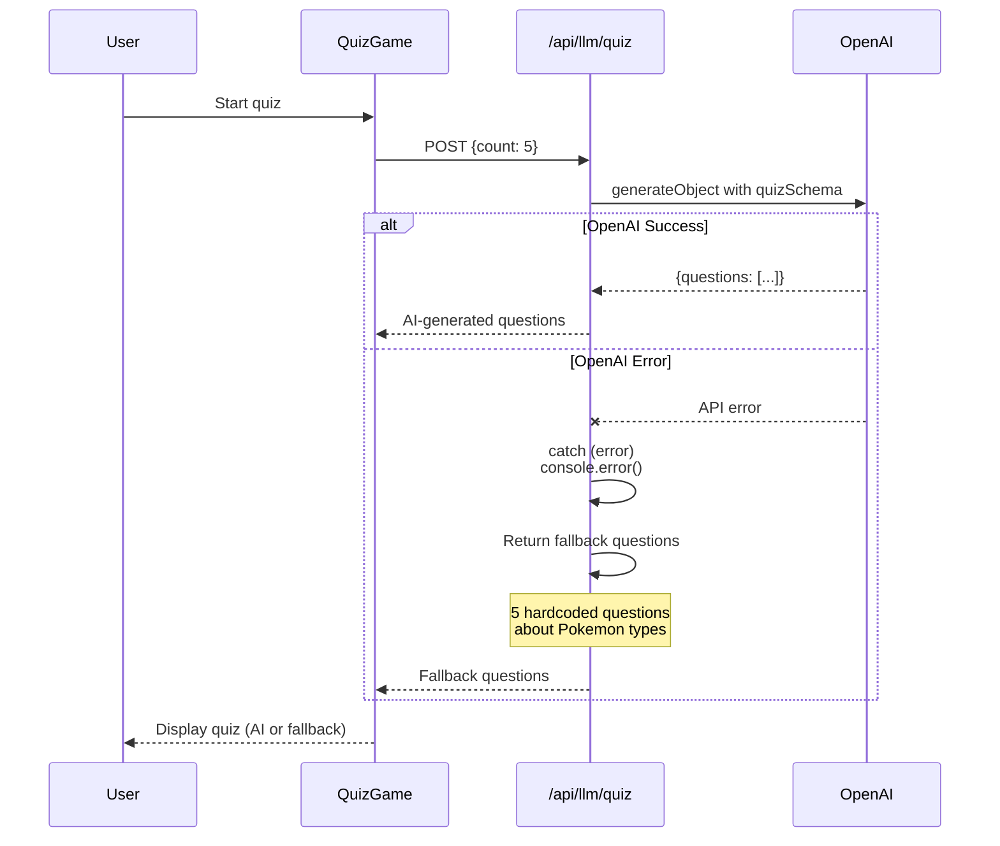
```mermaid
sequenceDiagram
    participant User
    participant QuizGame
    participant QuizAPI as /api/llm/quiz
    participant OpenAI

    User->>QuizGame: Start quiz
    QuizGame->>QuizAPI: POST {count: 5}
    QuizAPI->>OpenAI: generateObject with quizSchema

    alt OpenAI Success
        OpenAI-->>QuizAPI: {questions: [...]}
        QuizAPI-->>QuizGame: AI-generated questions
    else OpenAI Error
        OpenAI--xQuizAPI: API error
        QuizAPI->>QuizAPI: catch (error)<br/>console.error()
        QuizAPI->>QuizAPI: Return fallback questions
        Note over QuizAPI: 5 hardcoded questions<br/>about Pokemon types
        QuizAPI-->>QuizGame: Fallback questions
    end

    QuizGame-->>User: Display quiz (AI or fallback)
```

File: `app/api/llm/quiz/route.ts`
- Lines 51-82: Detailed fallback with complete quiz questions
- Fallback maintains game functionality

#### 4. Story API - Generic Continuation

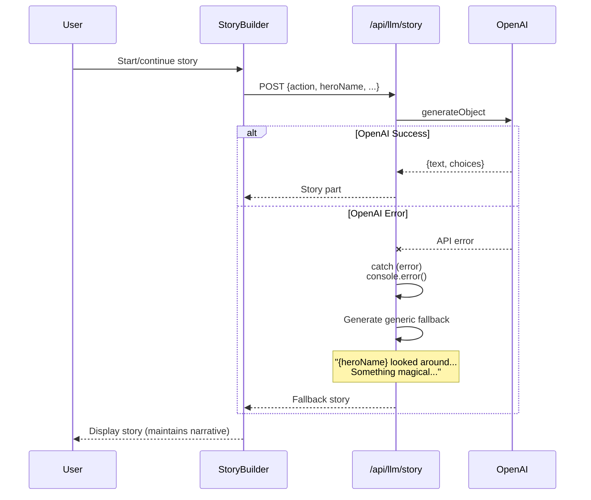
```mermaid
sequenceDiagram
    participant User
    participant StoryBuilder
    participant StoryAPI as /api/llm/story
    participant OpenAI

    User->>StoryBuilder: Start/continue story
    StoryBuilder->>StoryAPI: POST {action, heroName, ...}
    StoryAPI->>OpenAI: generateObject

    alt OpenAI Success
        OpenAI-->>StoryAPI: {text, choices}
        StoryAPI-->>StoryBuilder: Story part
    else OpenAI Error
        OpenAI--xStoryAPI: API error
        StoryAPI->>StoryAPI: catch (error)<br/>console.error()
        StoryAPI->>StoryAPI: Generate generic fallback
        Note over StoryAPI: "{heroName} looked around...<br/>Something magical..."
        StoryAPI-->>StoryBuilder: Fallback story
    end

    StoryBuilder-->>User: Display story (maintains narrative)
```

File: `app/api/llm/story/route.ts`
- Lines 70-76: Generic fallback story text
- Uses user's heroName to maintain personalization

#### 5. PokeAPI Client-Side Error Handling

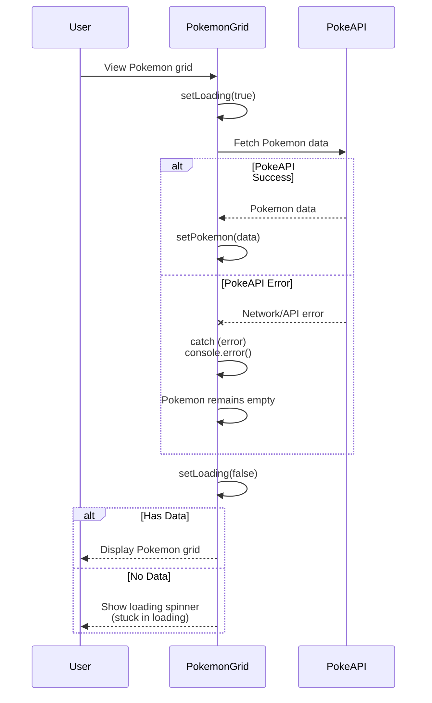
```mermaid
sequenceDiagram
    participant User
    participant PokemonGrid
    participant PokeAPI

    User->>PokemonGrid: View Pokemon grid
    PokemonGrid->>PokemonGrid: setLoading(true)
    PokemonGrid->>PokeAPI: Fetch Pokemon data

    alt PokeAPI Success
        PokeAPI-->>PokemonGrid: Pokemon data
        PokemonGrid->>PokemonGrid: setPokemon(data)
    else PokeAPI Error
        PokeAPI--xPokemonGrid: Network/API error
        PokemonGrid->>PokemonGrid: catch (error)<br/>console.error()
        PokemonGrid->>PokemonGrid: Pokemon remains empty
    end

    PokemonGrid->>PokemonGrid: setLoading(false)

    alt Has Data
        PokemonGrid-->>User: Display Pokemon grid
    else No Data
        PokemonGrid-->>User: Show loading spinner<br/>(stuck in loading)
    end
```

File: `components/pokemon-grid.tsx`
- Lines 87-89: Basic try-catch with console.error
- Could be improved with explicit error states

### Error Handling Summary by Component

| Component/Route | Error Type | Strategy | Fallback Quality |
|----------------|------------|----------|------------------|
| **chat/route.ts** | Blocked content | Content filtering redirect | High (safe AI response) |
| **query-pokeapi/route.ts** | OpenAI failure | Random Pokemon IDs | Medium (functional but not targeted) |
| **quiz/route.ts** | OpenAI failure | Hardcoded questions | High (complete fallback quiz) |
| **story/route.ts** | OpenAI failure | Generic story text | Medium (maintains flow) |
| **fun-fact/route.ts** | OpenAI failure | Generic fact template | Low (minimal personalization) |
| **game-hints/route.ts** | OpenAI failure | Pokemon data-based hints | Medium (uses real data) |
| **color-prompt/route.ts** | OpenAI failure | Hardcoded prompt+colors | High (complete fallback) |
| **pokemon-grid.tsx** | PokeAPI failure | No explicit fallback | Low (silent failure) |
| **professor-pine-chat.tsx** | Network failure | No explicit fallback | Low (error not shown) |

### Key Files Involved

**API Routes with Error Handling**:
- `app/api/llm/chat/route.ts` (lines 40-56)
- `app/api/llm/query-pokeapi/route.ts` (lines 46-54)
- `app/api/llm/quiz/route.ts` (lines 51-82)
- `app/api/llm/story/route.ts` (lines 70-76)
- `app/api/llm/fun-fact/route.ts` (lines 33-37)
- `app/api/llm/game-hints/route.ts` (lines 36-45)
- `app/api/llm/color-prompt/route.ts` (lines 41-46)

**Client Components with Error Handling**:
- `components/pokemon-grid.tsx` (lines 87-89)
- `components/pokemon-explorer.tsx` (lines 35-37)
- `components/story-builder.tsx` (lines 41-48)
- `components/pokemon-detail-modal.tsx` (lines 75-76)

### Error Handling Characteristics

1. **Multi-Layer Defense**: Errors caught at component, API route, and service levels
2. **Graceful Degradation**: Application remains functional with fallbacks
3. **User Experience**: Most errors invisible to users (fallbacks appear intentional)
4. **Logging**: Console.error used throughout for debugging
5. **Content Safety**: Proactive filtering prevents inappropriate content
6. **Timeout Protection**: maxDuration = 30 on API routes prevents hanging requests
7. **Improvement Opportunities**: Some components lack explicit error UI states

## Summary

The Poke Pals Interactive application demonstrates a well-architected data flow system with clear patterns:

### Architectural Highlights

1. **Client-Server Separation**: React components handle UI/state, Next.js API routes handle business logic and external service integration

2. **Security by Design**: API keys and sensitive operations isolated to server-side routes, never exposed to client

3. **Streaming First**: Real-time AI responses delivered via SSE streams for enhanced user experience

4. **Type Safety**: End-to-end TypeScript with Zod schema validation ensures data integrity

5. **Graceful Degradation**: Comprehensive fallback strategies ensure application remains functional even when external services fail

### Data Flow Patterns

| Pattern | Use Case | Files | Complexity |
|---------|----------|-------|------------|
| **Direct API Call** | PokeAPI queries | pokemon-grid.tsx | Low |
| **Streaming Response** | Chat interface | chat/route.ts, professor-pine-chat.tsx | High |
| **Structured Generation** | Quiz, Search, Story | query-pokeapi, quiz, story routes | Medium |
| **Simple Generation** | Fun facts | fun-fact/route.ts | Low |
| **Stateful Session** | Conversation history | useChat hook | Medium |

### Key Technology Integration

- **Vercel AI SDK**: Provides unified interface for OpenAI with streaming, structured output, and type safety
- **Next.js App Router**: File-based routing with server components and API routes
- **React Hooks**: Client-side state management (useState, useEffect, useChat)
- **Zod**: Runtime type validation for API responses
- **PokeAPI**: RESTful Pokemon data source

### Performance Considerations

1. **Pagination**: Pokemon grid loads 20 items at a time
2. **Lazy Loading**: "Load More" button prevents initial page bloat
3. **Streaming**: Chat responses appear incrementally, improving perceived performance
4. **Client-Side Filtering**: Search filtering happens on already-loaded data

### Areas for Enhancement

1. **Caching**: PokeAPI responses could be cached to reduce network calls
2. **Error UI**: Some components lack explicit error states for users
3. **Loading States**: More granular loading indicators could improve UX
4. **Retry Logic**: No automatic retry on transient failures
5. **Analytics**: No data flow tracking for usage patterns

### Security Features

1. **Content Filtering**: Regex-based blocking of inappropriate content
2. **Server-Side API Keys**: OpenAI key never exposed to client
3. **Input Validation**: Zod schemas validate all structured inputs
4. **Timeout Protection**: 30-second max duration prevents runaway requests
5. **Rate Limiting**: Relies on OpenAI's built-in rate limiting

This architecture provides a robust foundation for a kid-friendly AI-powered Pokemon exploration application, with clear data flows, strong error handling, and excellent developer experience through type safety and modern React patterns.
