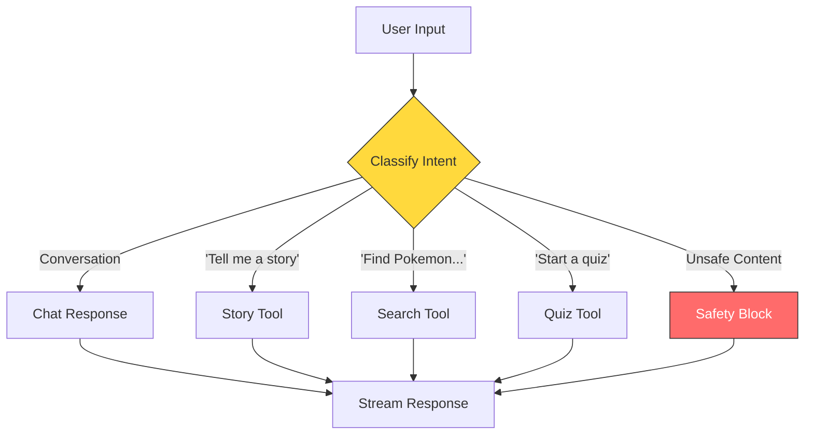
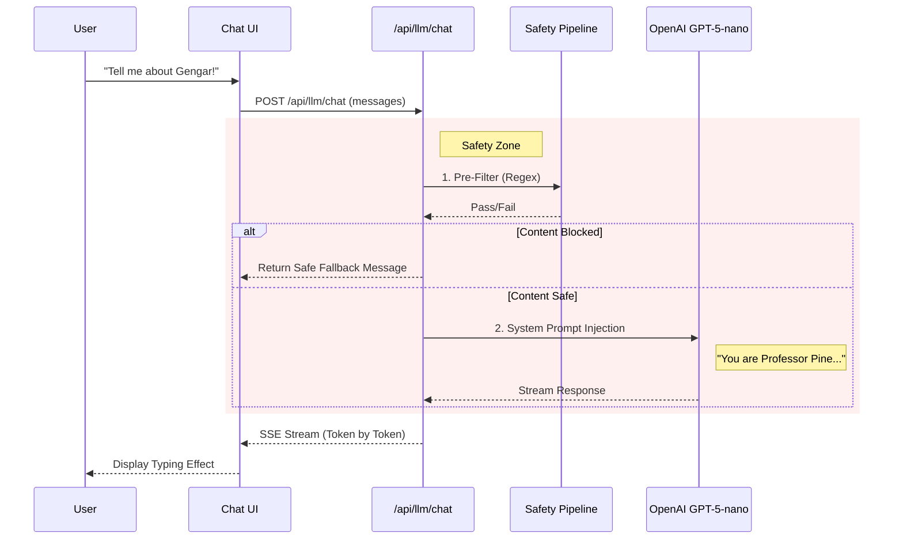

# Agentic Patterns & Cognitive Architecture

## Overview

This document describes the **agentic patterns** and **cognitive architecture** used in PokePals Interactive. While the system appears to the user as a simple chat or game interface, under the hood it employs specific architectural patterns to manage state, safety, and tool execution.

> [!NOTE]
> **Relation to Agent Frameworks**: This architecture is *not* LangGraph, but conceptually mirrors its ideas:
> *   Orchestrator node (Professor Pine)
> *   Tool nodes (Quiz, Story, Search)
> *   Optional memory nodes
> *   Deterministic routing vs generative steps

## 1. Agent-Oriented Architecture View

This diagram visualizes the "brain" of the application—how the system processes user intent, selects tools, and constructs responses. It highlights the separation between the **Orchestrator** (the LLM deciding what to do) and the **Execution Layer** (the tools and APIs carrying out the work).

```mermaid
graph TD
    subgraph "Cognitive Layer (The Brain)"
        User[User Input]
        Orchestrator[Orchestrator Agent<br/>Professor Pine / GPT-5-nano]
        Context[Context Window<br/>Chat History + System Prompt]
    end

    subgraph "Tool Layer (The Body)"
        QuizTool[Quiz Generator]
        StoryTool[Story Generator]
        SearchTool[PokeAPI Search]
        HintTool[Game Hints]
    end

    subgraph "Future Memory Layer (The Memory)"
        VectorDB[Vector Database<br/>(Future Implementation)]
        GraphDB[Knowledge Graph<br/>(Future Implementation)]
    end

    User --> Context
    Context --> Orchestrator
    
    Orchestrator -->|Decision: Chat| Response[Direct Response]
    Orchestrator -->|Decision: Tool Use| Router{Tool Router}
    
    Router -->|Need Quiz| QuizTool
    Router -->|Need Story| StoryTool
    Router -->|Need Info| SearchTool
    Router -->|Need Hint| HintTool

    QuizTool --> Response
    StoryTool --> Response
    SearchTool --> Response
    HintTool --> Response

    Orchestrator -.->|Retrieve| VectorDB
    Orchestrator -.->|Retrieve| GraphDB

    style Orchestrator fill:#ff6ec7,stroke:#333,color:#fff
    style Router fill:#ffd93d,stroke:#333
    style VectorDB fill:#e2e8f0,stroke:#333,stroke-dasharray: 5 5
    style GraphDB fill:#e2e8f0,stroke:#333,stroke-dasharray: 5 5
```

## 2. How AI Decides (Decision Tree)

The Orchestrator acts as a router, classifying user intent to select the appropriate tool or response path.



## 3. Router vs. Generator Patterns

The application employs two distinct modes of AI interaction, often referred to as "Router" and "Generator" patterns.

### Generator Mode (Creative)
*   **Purpose**: Create new, imaginative content based on constraints.
*   **Endpoints**: `/api/llm/chat`, `/api/llm/story`, `/api/llm/quiz`, `/api/llm/fun-fact`, `/api/llm/color-prompt`
*   **Behavior**: The LLM acts as a creative engine. It takes a prompt (e.g., "Tell me a story about a Charmander") and generates text, choices, or questions.
*   **Key Characteristic**: High entropy, variable output, "personality" driven.

### Router / Policy Mode (Deterministic)
*   **Purpose**: Translate user intent into specific API calls or structured data.
*   **Endpoints**: `/api/llm/query-pokeapi`, `/api/llm/game-hints`
*   **Behavior**: The LLM acts as a logic engine. It takes natural language and converts it into a structured query object.
*   **Key Characteristic**: Low entropy, strict schema adherence, "logic" driven.

**Example Flow:**
> **User:** "Find all small fire Pokémon."
> **Router Output:** `{ types: ["fire"], size: "small" }`
> **Tool:** `searchPokemon()` returns IDs + metadata
> **LLM Response:** Synthesized explanation + list of Pokémon

## 4. Tool Contract Architecture

Every tool invocation follows a strict contract to ensure type safety and reliability.

```mermaid
graph LR
    Intent[User Intent] --> Router[LLM Router]
    Router -->|Generate| Input[Input Schema<br/>(Zod)]
    Input -->|Validate| Execution[Tool Execution]
    Execution -->|Return| Output[Output Schema<br/>(Zod)]
    Output -->|Synthesize| Response[Final Response]

    style Input fill:#a8e6cf,stroke:#333
    style Output fill:#a8e6cf,stroke:#333
```

## 5. Chat Request Sequence

This sequence diagram illustrates the complete lifecycle of a chat message, highlighting the critical **Safety Pipeline** that protects young users.



## 6. Future Roadmap: Memory & Persistence

As the application evolves into a fully agentic system, a **Memory Layer** will be introduced to support long-term engagement.

*   **Short-term Memory**: Currently handled by the `messages` array in the chat context.
*   **Long-term Memory (Future)**:
    *   **User Preferences**: Remembering favorite Pokemon, past quiz scores (Vector DB).
    *   **World State**: Tracking progress in ongoing stories (Graph DB).
    *   **Fact Retrieval**: RAG (Retrieval-Augmented Generation) for deeper Pokemon lore.
    *   **Event Log**: Temporal/Durable execution log for debugging and replayability.
