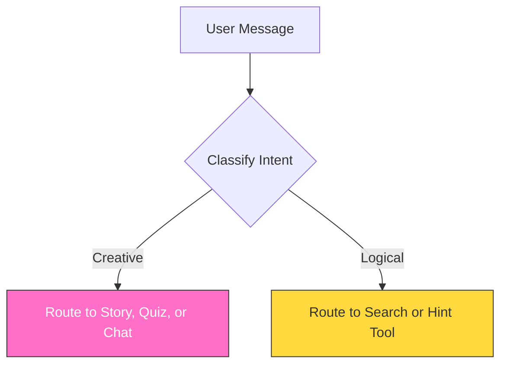

<!-- _class: lead -->

# 🎓 A Guided Journey for Developers: PokéPals Architecture Tour
## Tracing the flow from "Button Click" to "AI" to "Tools Response"

### PokéPals Interactive

<!--
Speaker Notes:
Welcome to the PokéPals Architecture Tour.
We're going to trace the full journey of a user interaction—from the moment a kid clicks a button, all the way to the AI brain and back.
This isn't just a web app; it's an agentic system. Let's see how it works.
-->

---

# 🧭 Tour Stop 1: The Big Picture
## Understanding the Global Data Journey


**Process Flow:**
1. **User Action**: Click/Query.
2. **UI Layer**: Next.js/React captures event.
3. **API Layer**: Secure request sent to server.
4. **Safety Shield**: Input filtered for kid-friendly content.
5. **AI Brain (LLM)**: Orchestrator decides action.
6. **Tool Execution**: Calls specific functions/services.
7. **Response**: Data sent back to UI.

<!--
Speaker Notes:
Here is the 10,000-foot view.
Notice the flow: Left to Right.
The critical thing to spot here is the "Safety Pipeline" sitting right in front of the "Cognitive Layer".
Nothing touches the AI without passing through our guards first.
-->

---

# 🎨 Tour Stop 2: The Presentation Layer
## Where the User Experience Begins

**Tech Stack**: Next.js 16, React 19, Tailwind CSS, Radix UI.

### Component Strategy
*   **Server Components**: Initial load & data fetching (SSR).
*   **Client Components**: Interactive elements (Chat, Games) marked with `"use client"`.

> **Security Insight**: The UI is a secure view layer; it never holds API keys.

<!--
Speaker Notes:
We use a standard Next.js pattern here.
Server Components for speed and SEO. Client Components for the fun stuff.
Crucially: The browser is untrusted. We never put API keys in the client.
The UI is just a "dumb" view layer; the intelligence lives on the server.
-->

---

# 🏗️ Tour Stop 3: The Business Logic Layer
## The Server-Side "Controller" for AI

**Location**: `/app/api/llm/*`

**Key Endpoints**:
*   Chat, Quiz, Story, Query PokeAPI, Game Hints.

**Responsibilities**:
1.  **Parse/Validate Input**: Zod schemas ensure data integrity.
2.  **Enforce Safety Guards**: Protects the LLM from bad inputs.
3.  **Make Authenticated Calls**: Uses Vercel AI SDK to talk to OpenAI.

<!--
Speaker Notes:
This is the engine room.
Every AI feature has its own dedicated endpoint.
We don't just pass JSON around; we validate everything with Zod schemas.
If the data isn't perfect, the AI doesn't see it.
-->

---

# 🔐 Tour Stop 4: The Safety Pipeline
## Protecting Users Before the LLM Sees a Single Token

**Pipeline Stages**:

1.  **Stage 1 (Regex Pre-Filter)**:
    *   Instantly blocks forbidden patterns (e.g., violence, hate).
    *   Returns safe canned response if triggered.

2.  **Stage 2 (System Prompt Injection)**:
    *   Wraps user prompt with "Professor Pine" persona, tone, and safety rules.

**Output**: A safe, contextualized prompt sent to the LLM.

<!--
Speaker Notes:
Safety isn't an afterthought; it's a pipeline.
We use "Defense in Depth".
First, a fast Regex filter catches the obvious stuff.
Then, the System Prompt enforces the persona.
Only then do we let the LLM generate tokens.
-->

---

# 🛡️ Deep Dive: The Philosophy of Kid-Friendly AI Safety
## Strategy: "Defense in Depth"

**The Three Shields**:

1.  **The Fast Layer (Regex)**:
    *   0ms latency. Blocks high-risk keywords.

2.  **The Smart Layer (System Prompt)**:
    *   Contextual safety. Enforces grade 2-4 reading level and positive tone.

3.  **The Fail-Safe (Redirection)**:
    *   Redirects conversations to safe, fun topics rather than just erroring out.

<!--
Speaker Notes:
Let's look closer at that safety logic.
We have a "Fast Layer" (Regex) and a "Smart Layer" (The LLM).
If the Regex trips, we don't crash. We pivot.
We return a "Safe Fallback" message like "Let's talk about Pokemon instead!"
This keeps the experience magical, even when we have to say no.
-->

---

# 🧠 Tour Stop 5: Agentic Thinking
## The LLM as a Decision-Making Engine

**Operational Modes**:

### Generator Mode (Creative)
*   **High Entropy / Variable**.
*   Used for chatting, stories, and quizzes.

### Router/Policy Mode (Deterministic)
*   **Low Entropy / Strict Schema**.
*   Used for translating intent into structured actions (search, game hints).

<!--
Speaker Notes:
This is the core agentic concept.
Sometimes the AI is a Poet (Generator Mode).
Sometimes the AI is a Librarian (Router Mode).
Knowing when to switch modes is the key to building reliable agents.
-->

---

# ⚙️ Deep Dive: Modes in Action
## Mapping Patterns to API Endpoints

### Creative Engine
*   **Endpoints**: `POST /chat`, `/story`, `/quiz`
*   **Mechanism**: Uses `streamText` for freeform output.
*   **Goal**: Engagement and imagination.

### Logic Engine
*   **Endpoints**: `POST /query-pokeapi`, `/game-hints`
*   **Mechanism**: Uses `generateObject` with Zod schemas for structured JSON.
*   **Goal**: Precision and data retrieval.

<!--
Speaker Notes:
Here is how that theory maps to code.
Chat and Story endpoints use `streamText` because we want the AI to flow.
Search and Hints use `generateObject` because we need precise JSON to query our database.
Different tools for different jobs.
-->

---

# 🌳 Tour Stop 6: How the AI Decides
## Visualizing the Router's Decision Tree



**Takeaway**: This classification and routing is the core of **"Agentic Architecture."**

<!--
Speaker Notes:
This decision tree is the "Brain" of our agent.
It classifies intent before taking action.
This is exactly how frameworks like LangGraph work under the hood.
We're just doing it explicitly here.
-->

---

# 🧩 Deep Dive: From Natural Language to Executable Code
## The Router's Inner Workings

**Step-by-Step Example**:

1.  **User Intent**:
    > "Show me cute and small Pokémon that can fly."

2.  **Router Output**:
    *   LLM generates structured JSON:
    ```json
    { "pokemonIds": [25, 39, 151] }
    ```

3.  **Tool Execution**:
    *   App code uses the IDs to fetch data from PokeAPI.

<!--
Speaker Notes:
This is the magic trick.
We turn messy human language into clean, structured JSON.
The LLM acts as a translator.
Once we have that JSON object, we're back in the world of reliable code.
-->

---

# 📜 Tour Stop 7: Tool Contracts
## The Formal Interface Between the LLM and Functions

**The 5-Step Contract**:

1.  **Intent**: User needs a tool.
2.  **Routing**: LLM identifies tool & generates JSON parameters.
3.  **Validation**: Zod schema validates JSON structure.
4.  **Execution**: Validated JSON passed to TypeScript function.
5.  **Response**: Return value formatted and sent to user.

<!--
Speaker Notes:
We strictly enforce contracts between the Brain and the Body.
If the Router outputs bad JSON, Zod catches it before it hits our API.
This prevents hallucinations from crashing our backend.
-->

---

# 📦 Bonus Stop: The Future is a Memory Layer
## Evolving from a Stateless App to a Stateful Agent

**Proposed Additions**:

*   **Vector DB (RAG)**: Long-term memory of facts/lore.
*   **Event Log**: Durable execution history for debugging/resuming.
*   **Graph DB**: Tracking complex relationships and multi-session story states.

<!--
Speaker Notes:
Finally, where are we going?
Memory.
Right now, we have short-term chat memory.
Soon, we'll add Vector DBs for long-term recall and Graph DBs for world state.
-->

---

<!-- _class: lead -->

# 🚀 Conclusion / Call to Action
## "Now, It's Your Turn to Build."

### Resources for Learning
*   `README.md`: Project setup.
*   `06_architecture_tour.md`: Text version of this tour.
*   `/app/api/llm/chat/route.ts`: Safety Pipeline code.
*   `/app/api/llm/query-pokeapi/route.ts`: Router code.
*   `/components/professor-pine-chat.tsx`: Client-side Vercel AI SDK implementation.

**PokePals Interactive**
*Teaching the Next Generation of AI Engineers*

<!--
Speaker Notes:
That's the tour!
You have the map. Now go explore the code.
Thanks for listening.
-->
