# AIE OnRamp Session 1 - Visual Diagrams

This document provides visual diagrams to help understand the development workflow and architecture covered in Session 1.

---

## 1. Deployment & Implementation Architecture

This diagram shows the tools, services, and how they connect in your development pipeline.

```mermaid
graph TB
    subgraph "Development Environment"
        DEV[👩‍💻 Developer]
        CURSOR[Cursor IDE<br/>AI-Assisted Editor]
        LOCAL[Local Dev Server<br/>localhost:3000]
    end

    subgraph "AI-Powered Tools"
        V0[v0.dev<br/>Frontend Generator]
        CHATGPT[ChatGPT<br/>Brainstorming]
        CURSOR_AI[Cursor AI<br/>Code Assistance]
    end

    subgraph "Design Resources"
        CANVA[Canva Templates<br/>Design Inspiration]
        SHADCN[shadcn/ui<br/>Component Library]
        COOLORS[Coolors<br/>Color Palettes]
    end

    subgraph "Version Control"
        GIT_LOCAL[Local Git Repo]
        GITHUB[GitHub<br/>Remote Repository]
        UPSTREAM[AIM Upstream Repo<br/>Course Materials]
    end

    subgraph "Deployment"
        VERCEL[Vercel<br/>Hosting Platform]
        CDN[Global CDN<br/>Production App]
    end

    DEV --> CHATGPT
    DEV --> V0
    CHATGPT --> V0
    CANVA --> V0
    SHADCN --> V0
    COOLORS --> V0

    V0 -->|npx download| CURSOR
    CURSOR --> CURSOR_AI
    CURSOR --> LOCAL
    CURSOR --> GIT_LOCAL

    GIT_LOCAL -->|git push origin| GITHUB
    UPSTREAM -->|git pull upstream| GIT_LOCAL

    GITHUB -->|auto deploy| VERCEL
    VERCEL --> CDN

    style V0 fill:#7c3aed,color:#fff
    style CURSOR fill:#0ea5e9,color:#fff
    style GITHUB fill:#24292e,color:#fff
    style VERCEL fill:#000,color:#fff
    style CDN fill:#10b981,color:#fff
```



---

## 2. Complete Workflow Sequence

This flowchart shows the step-by-step process from idea to deployment.

```mermaid
flowchart TD
    START([🚀 Start]) --> IDEA

    subgraph PHASE1["Phase 1: Ideation"]
        IDEA[💡 Step 1: Brainstorm Your Idea]
        IDEA --> CHATGPT_USE{Use ChatGPT<br/>or v0?}
        CHATGPT_USE -->|ChatGPT| REFINE[Refine concept<br/>with feedback]
        CHATGPT_USE -->|v0| EXPLORE[Explore ideas<br/>in chat]
        REFINE --> DESIGN
        EXPLORE --> DESIGN
    end

    subgraph PHASE2["Phase 2: Design Resources"]
        DESIGN[🎨 Step 2: Get Design Resources]
        DESIGN --> TEMPLATE{Use v0 Templates<br/>or Custom?}
        TEMPLATE -->|Templates| V0_TEMPLATE[Browse v0<br/>template library]
        TEMPLATE -->|Custom| CANVA_PICK[Pick Canva<br/>template style]
        CANVA_PICK --> SHADCN_PICK[Choose shadcn/ui<br/>components]
        SHADCN_PICK --> COLORS[Select Coolors<br/>color scheme]
        V0_TEMPLATE --> PROMPT
        COLORS --> PROMPT
    end

    subgraph PHASE3["Phase 3: Generate App"]
        PROMPT[🎬 Step 3: Create v0 Prompt]
        PROMPT --> COMBINE[Combine:<br/>• App idea<br/>• Template style<br/>• Components<br/>• Colors]
        COMBINE --> GENERATE[Generate app in v0]
        GENERATE --> DOWNLOAD[Download with<br/>npx command]
    end

    subgraph PHASE4["Phase 4: Environment Setup"]
        ENV[🛠️ Step 4: Setup Dev Environment]
        ENV --> INSTALL_TOOLS[Install:<br/>Git, Node.js, Cursor]
        INSTALL_TOOLS --> SSH[Generate SSH keys]
        SSH --> ADD_SSH[Add SSH key<br/>to GitHub]
        ADD_SSH --> CONFIG_GIT[Configure Git<br/>user.email & user.name]
        CONFIG_GIT --> VERIFY[Verify installations]
    end

    DOWNLOAD --> ENV

    subgraph PHASE5["Phase 5: Repository Setup"]
        REMOTE[🔗 Step 5: Connect to AIM Repo]
        REMOTE --> CREATE_REPO[Create GitHub repo<br/>empty, no README]
        CREATE_REPO --> CLONE_EMPTY[Clone empty repo]
        CLONE_EMPTY --> ADD_UPSTREAM[Add upstream remote<br/>to AIM course repo]
        ADD_UPSTREAM --> PULL_UPSTREAM[Pull from upstream]
    end

    VERIFY --> REMOTE

    subgraph PHASE6["Phase 6: GitHub Setup"]
        GH_REPO[🐙 Step 6: Create GitHub Repo]
        GH_REPO --> NEW_REPO[Create new repository]
        NEW_REPO --> COPY_SSH[Copy SSH URL]
    end

    PULL_UPSTREAM --> GH_REPO

    subgraph PHASE7["Phase 7: Development"]
        DEV_START[📥 Step 7: Clone & Download in Cursor]
        DEV_START --> CLONE_CURSOR[Clone repo in Cursor<br/>Cmd+Shift+P → Git: Clone]
        CLONE_CURSOR --> NPX[Run npx command<br/>from v0]
        NPX --> NPM_INSTALL[npm install<br/>--legacy-peer-deps if needed]
        NPM_INSTALL --> RUN_DEV[npm run dev]
        RUN_DEV --> TEST_LOCAL[Test on localhost:3000]
        TEST_LOCAL --> GEN_README[Generate README<br/>with Cursor AI]
        GEN_README --> COMMIT[git add . && git commit]
        COMMIT --> PUSH[git push -u origin main]
    end

    COPY_SSH --> DEV_START

    subgraph PHASE8["Phase 8: Deployment"]
        DEPLOY[🌐 Step 8: Deploy to Vercel]
        DEPLOY --> VERCEL_CMD[vercel --prod]
        VERCEL_CMD --> LIVE[🎉 App is LIVE!]
    end

    PUSH --> DEPLOY
    LIVE --> DONE([✅ Complete!])

    style START fill:#22c55e,color:#fff
    style DONE fill:#22c55e,color:#fff
    style LIVE fill:#10b981,color:#fff
    style PHASE1 fill:#fef3c7
    style PHASE2 fill:#fce7f3
    style PHASE3 fill:#e0e7ff
    style PHASE4 fill:#ccfbf1
    style PHASE5 fill:#fef9c3
    style PHASE6 fill:#f3e8ff
    style PHASE7 fill:#dbeafe
    style PHASE8 fill:#dcfce7
```



---

## 3. Git Remote Configuration

This diagram shows how your local repository connects to multiple remotes.

```mermaid
graph LR
    subgraph "Your Machine"
        LOCAL[🖥️ Local Git Repo]
    end

    subgraph "GitHub - Your Account"
        ORIGIN["origin<br/>git@github.com:yourusername/yourrepo.git"]
    end

    subgraph "GitHub - AI Maker Space"
        UPSTREAM["upstream<br/>git@github.com:AI-Maker-Space/AIEO2.git"]
    end

    LOCAL -->|git push origin main| ORIGIN
    LOCAL -->|git pull origin main| ORIGIN
    UPSTREAM -->|git pull upstream main| LOCAL

    style LOCAL fill:#3b82f6,color:#fff
    style ORIGIN fill:#22c55e,color:#fff
    style UPSTREAM fill:#f59e0b,color:#fff
```



**Commands:**
```bash
# Push your changes
git push origin main

# Pull course updates
git pull upstream main --allow-unrelated-histories
```

---

## 4. GitFlow Branch Strategy

This diagram illustrates the branching strategy for feature development.


**Branch Types:**
- `main` - Production-ready code
- `develop` - Integration branch
- `feature/*` - New features
- `release/*` - Release preparation

---

## 5. CI/CD Pipeline with Vercel

This sequence diagram shows the automatic deployment flow.

```mermaid
sequenceDiagram
    participant Dev as 👩‍💻 Developer
    participant Local as 💻 Local
    participant GH as 🐙 GitHub
    participant Vercel as ▲ Vercel
    participant CDN as 🌍 CDN

    Dev->>Local: npm run dev (test locally)
    Dev->>Local: git add . && git commit
    Dev->>GH: git push origin main

    Note over GH,Vercel: Webhook triggers auto-deploy

    GH->>Vercel: Push event notification
    Vercel->>Vercel: npm install
    Vercel->>Vercel: npm run build

    alt Build Success
        Vercel->>CDN: Deploy to global edge
        CDN-->>Dev: 🎉 Live URL ready!
    else Build Failure
        Vercel-->>Dev: ❌ Build logs & errors
    end
```



---

## 6. Technology Stack Overview


---

## 7. Troubleshooting Decision Tree

```mermaid
flowchart TD
    PROBLEM([🔧 Problem?]) --> TYPE{What type?}

    TYPE -->|npm install fails| NPM
    TYPE -->|Port 3000 in use| PORT
    TYPE -->|Git push fails| GIT
    TYPE -->|Vercel deploy fails| VERCEL

    subgraph NPM["npm Issues"]
        NPM1[Try: npm install --legacy-peer-deps]
        NPM1 --> NPM2{Still failing?}
        NPM2 -->|Yes| NPM3[npm uninstall vaul]
        NPM2 -->|No| FIXED1([✅ Fixed!])
        NPM3 --> NPM4[Commit package.json changes]
        NPM4 --> FIXED1
    end

    subgraph PORT["Port Issues"]
        PORT1["kill -9 $(lsof -ti tcp:3000)"]
        PORT1 --> PORT2[Restart: npm run dev]
        PORT2 --> FIXED2([✅ Fixed!])
    end

    subgraph GIT["Git Issues"]
        GIT1{SSH key added<br/>to GitHub?}
        GIT1 -->|No| GIT2[Add SSH key to GitHub Settings]
        GIT1 -->|Yes| GIT3[Check: git remote -v]
        GIT2 --> FIXED3([✅ Fixed!])
        GIT3 --> GIT4[Try HTTPS instead of SSH]
        GIT4 --> FIXED3
    end

    subgraph VERCEL["Vercel Issues"]
        V1[Check build logs in dashboard]
        V1 --> V2{Missing dependencies?}
        V2 -->|Yes| V3[Add to package.json]
        V2 -->|No| V4{Has build script?}
        V4 -->|No| V5[Add build script]
        V4 -->|Yes| V6[Check framework detection]
        V3 --> FIXED4([✅ Fixed!])
        V5 --> FIXED4
        V6 --> FIXED4
    end

    style FIXED1 fill:#22c55e,color:#fff
    style FIXED2 fill:#22c55e,color:#fff
    style FIXED3 fill:#22c55e,color:#fff
    style FIXED4 fill:#22c55e,color:#fff
```



---

## Quick Reference Commands

| Step | Command |
|------|---------|
| Clone repo | `git clone git@github.com:user/repo.git` |
| Add upstream | `git remote add upstream git@github.com:AI-Maker-Space/AIEO2.git` |
| Pull upstream | `git pull upstream main --allow-unrelated-histories` |
| Install deps | `npm install` or `npm install --legacy-peer-deps` |
| Run locally | `npm run dev` |
| Kill port 3000 | `kill -9 $(lsof -ti tcp:3000)` |
| Commit | `git add . && git commit -m "message"` |
| Push | `git push origin main` |
| Deploy | `vercel --prod` |

---

## 8. Assignment Workflow: 9-Step Development Process

This diagram covers the complete assignment workflow from GitHub repo creation through GitFlow and redeployment.

```mermaid
flowchart TD
    START([🚀 Start Assignment]) --> S1

    subgraph S1_BOX["Step 1: Create GitHub Repository"]
        S1[🐙 Create GitHub Repo]
        S1 --> S1A[Go to GitHub → New repo]
        S1A --> S1B[Name your repo]
        S1B --> S1C["DO NOT initialize<br/>(no README, .gitignore)"]
        S1C --> S1D[Copy SSH URL]
    end

    subgraph S2_BOX["Step 2: Generate Frontend with v0"]
        S2[🎨 Generate Frontend]
        S2 --> S2A[Brainstorm idea<br/>ChatGPT or v0]
        S2A --> S2B[Gather design resources<br/>Canva + shadcn + Coolors]
        S2B --> S2C[Create detailed v0 prompt]
        S2C --> S2D[Generate & iterate in v0]
    end

    S1D --> S2

    subgraph S3_BOX["Step 3: Clone & Download in Cursor"]
        S3[📥 Setup in Cursor]
        S3 --> S3A["Cmd+Shift+P → Git: Clone"]
        S3A --> S3B[Paste SSH URL]
        S3B --> S3C[Run npx command from v0]
        S3C --> S3D[npm install]
        S3D --> S3E[npm run dev → Test locally]
        S3E --> S3F[Generate README with Cursor]
        S3F --> S3G[git add . && commit && push]
    end

    S2D --> S3

    subgraph S4_BOX["Step 4: Deploy to Vercel"]
        S4[🌐 Initial Deploy]
        S4 --> S4A[cd to frontend folder]
        S4A --> S4B[vercel --prod]
        S4B --> S4C[🎉 App is LIVE!]
    end

    S3G --> S4

    subgraph S5_BOX["Step 5: Set Up Cursor Rules (Optional)"]
        S5[📝 Cursor Rules]
        S5 --> S5A[Create cursor_rules.md]
        S5A --> S5B[Define coding standards<br/>naming, imports, structure]
    end

    S4C --> S5

    subgraph S6_BOX["Step 6: Make Changes with Cursor Agents"]
        S6[🤖 Use Cursor Agents]
        S6 --> S6A[Plan improvements]
        S6A --> S6B[Open Cursor Agents panel]
        S6B --> S6C[Describe changes in natural language]
        S6C --> S6D[Review generated code]
        S6D --> S6E[Test locally: npm run dev]
    end

    S5B --> S6

    subgraph S7_BOX["Step 7: GitFlow - Feature Branch"]
        S7[🌿 Create Feature Branch]
        S7 --> S7A[git switch main && git pull]
        S7A --> S7B["git switch -c feature/your-feature"]
        S7B --> S7C["git push -u origin feature/..."]
        S7C --> S7D[git add . && commit]
        S7D --> S7E[git push]
    end

    S6E --> S7

    subgraph S8_BOX["Step 8: Review & Merge"]
        S8[🔀 Merge Changes]
        S8 --> S8A[Test locally ✓]
        S8A --> S8B[Go to GitHub]
        S8B --> S8C[Create Pull Request]
        S8C --> S8D[Review Files Changed]
        S8D --> S8E["Merge (Create merge commit)"]
        S8E --> S8F[Delete feature branch]
        S8F --> S8G[git switch main && git pull]
    end

    S7E --> S8

    subgraph S9_BOX["Step 9: Redeploy"]
        S9[🚀 Automatic Redeploy]
        S9 --> S9A[Vercel detects new commits]
        S9A --> S9B[Auto-build triggered]
        S9B --> S9C[Visit live site]
        S9C --> S9D[🎉 Changes are LIVE!]
    end

    S8G --> S9
    S9D --> DONE([✅ Assignment Complete!])

    style START fill:#3b82f6,color:#fff
    style DONE fill:#22c55e,color:#fff
    style S4C fill:#10b981,color:#fff
    style S9D fill:#10b981,color:#fff
    style S1_BOX fill:#f3e8ff
    style S2_BOX fill:#fce7f3
    style S3_BOX fill:#dbeafe
    style S4_BOX fill:#dcfce7
    style S5_BOX fill:#fef3c7
    style S6_BOX fill:#e0e7ff
    style S7_BOX fill:#ccfbf1
    style S8_BOX fill:#fef9c3
    style S9_BOX fill:#dcfce7
```



---

## 9. Full-Stack Architecture (Activity #2)

This diagram shows the advanced backend integration architecture with Python FastAPI and LLM.


---

## 10. Activity #2: Backend Integration Workflow

Step-by-step sequence for creating and connecting a full-stack application.

```mermaid
sequenceDiagram
    participant Dev as 👩‍💻 Developer
    participant GH as 🐙 GitHub
    participant Cursor as 💻 Cursor IDE
    participant v0 as 🎨 v0.dev
    participant BE as 🐍 Backend
    participant FE as ⚛️ Frontend

    Note over Dev,FE: Phase 1: Backend Setup
    Dev->>GH: Create new repository (empty)
    Dev->>Cursor: Clone repository
    Dev->>Cursor: Copy app.py to repo root
    Dev->>BE: uv sync (install deps)
    Dev->>BE: uvicorn app:app --reload
    Dev->>BE: Test /sentiment endpoint
    Dev->>GH: git commit & push backend

    Note over Dev,FE: Phase 2: Frontend Generation
    Dev->>v0: Upload app.py file
    Dev->>v0: Prompt for frontend UI
    v0-->>Dev: Generate React frontend
    Dev->>Cursor: npx create-v0-app frontend

    Note over Dev,FE: Phase 3: Integration
    Dev->>FE: npm install
    Dev->>Cursor: Update API URLs to localhost:8000
    Dev->>BE: Add CORS middleware (if needed)

    Note over Dev,FE: Phase 4: Run Full Stack
    Dev->>BE: Terminal 1: uvicorn --port 8000
    Dev->>FE: Terminal 2: npm run dev
    Dev->>FE: Test full integration

    Note over Dev,FE: Phase 5: Commit & Push
    Dev->>GH: git add . && commit && push
    Dev->>GH: Verify all files present
```



---

## 11. GitFlow Feature Branch Workflow

Detailed view of the branching and merging process used in the assignment.


**Feature Branch Commands:**
```bash
# Create and switch to feature branch
git switch -c feature/dark-mode

# Make commits
git add .
git commit -m "feat: add dark mode toggle"

# Push feature branch
git push -u origin feature/dark-mode

# After PR merge, clean up
git switch main
git pull origin main
git branch -d feature/dark-mode
```

---

## 12. Pull Request Merge Flow

Visual representation of the GitHub PR review and merge process.


---

## 13. Commit Message Convention

Quick reference for semantic commit messages used in GitFlow.


---

## 14. Suggested Features Decision Guide

Help students choose which feature to implement for Activity #1.

```mermaid
flowchart TD
    START([Which feature<br/>should I add?]) --> Q1{Want visual<br/>improvements?}

    Q1 -->|Yes| Q2{Styling or<br/>Animation?}
    Q1 -->|No| Q3{New functionality<br/>or Performance?}

    Q2 -->|Styling| DARK[🌙 Dark Mode<br/>feature/dark-mode]
    Q2 -->|Animation| ANIM[✨ Animations<br/>feature/animations]

    Q3 -->|Functionality| Q4{UI Component<br/>or Responsive?}
    Q3 -->|Performance| PERF[⚡ Optimization<br/>feature/performance]

    Q4 -->|Component| COMP[🧩 New Component<br/>feature/new-component]
    Q4 -->|Responsive| RESP[📱 Responsive<br/>feature/responsive]

    DARK --> IMPL[Implement with<br/>Cursor Agents]
    ANIM --> IMPL
    PERF --> IMPL
    COMP --> IMPL
    RESP --> IMPL

    IMPL --> TEST[Test Locally]
    TEST --> BRANCH[Create Feature Branch]
    BRANCH --> COMMIT[Commit Changes]
    COMMIT --> PR[Create PR & Merge]
    PR --> DONE([🎉 Feature Complete!])

    style START fill:#3b82f6,color:#fff
    style DONE fill:#22c55e,color:#fff
    style DARK fill:#6366f1,color:#fff
    style ANIM fill:#ec4899,color:#fff
    style PERF fill:#f59e0b,color:#fff
    style COMP fill:#10b981,color:#fff
    style RESP fill:#0ea5e9,color:#fff
```



---

## 15. Two-Terminal Development Setup

Visual guide for running backend and frontend simultaneously.


---

## Quick Reference: All Commands

### Frontend Commands
| Action | Command |
|--------|---------|
| Clone repo | `git clone git@github.com:user/repo.git` |
| Install deps | `npm install` or `npm install --legacy-peer-deps` |
| Run frontend | `npm run dev` |
| Build | `npm run build` |
| Kill port 3000 | `kill -9 $(lsof -ti tcp:3000)` |
| Deploy | `vercel --prod` |

### Backend Commands (Activity #2)
| Action | Command |
|--------|---------|
| Install uv | `pip install uv` |
| Sync dependencies | `uv sync` |
| Run backend | `uv run uvicorn app:app --reload` |
| Test endpoint | `curl -X POST "http://localhost:8000/sentiment" -H "Content-Type: application/json" -d '{"text": "I love this!"}'` |
| View API docs | Open `http://localhost:8000/docs` |
| Kill port 8000 | `kill -9 $(lsof -ti tcp:8000)` |

### Git Commands
| Action | Command |
|--------|---------|
| Add upstream | `git remote add upstream git@github.com:AI-Maker-Space/AIEO2.git` |
| Pull upstream | `git pull upstream main --allow-unrelated-histories` |
| Create branch | `git switch -c feature/name` |
| Commit | `git add . && git commit -m "feat: message"` |
| Push branch | `git push -u origin feature/name` |
| Switch to main | `git switch main` |
| Pull latest | `git pull origin main` |
| Delete branch | `git branch -d feature/name` |

---

*These diagrams are rendered using [Mermaid.js](https://mermaid.js.org/). View them in any Markdown viewer that supports Mermaid (GitHub, VS Code with extensions, etc.).*